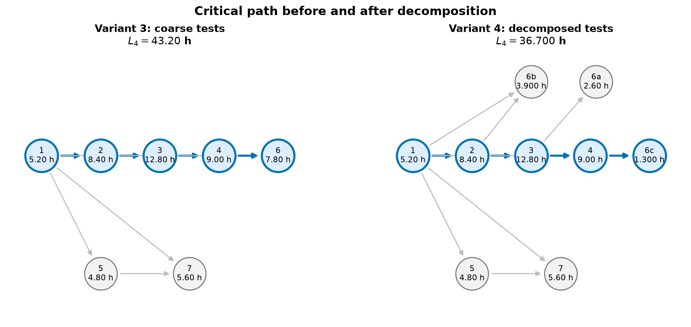
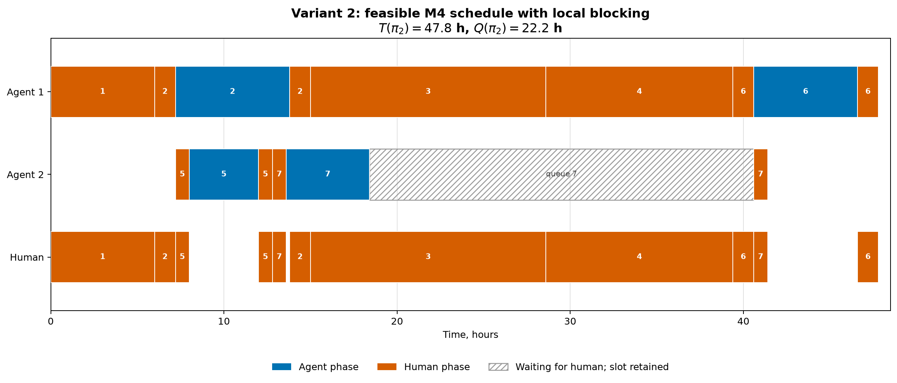

# Отчёт по EXP-00: воспроизведение расчётов статьи

Дата отчёта: 2026-08-07

Статус: завершён обязательный блок вариантов 2--4; результаты проверены
регрессионными тестами и точным решателем.

## 1. Резюме

Эксперимент воспроизвёл агрегаты, расписания и нижнюю границу фазовой модели M4
для практических вариантов 2--4. Для всех трёх сценариев CP-SAT доказал
оптимальность расписаний статьи:

| Вариант | Нижняя граница $B_4$, ч | Оптимум $T^*$, ч | Расписание статьи, ч | Baseline, ч | Gap baseline к $T^*$ |
|---|---:|---:|---:|---:|---:|
| 2 | 47,8 | 47,8 | 47,8 | 48,6 | 0,8 (1,674%) |
| 3 | 43,2 | 43,2 | 43,2 | 43,6 | 0,4 (0,926%) |
| 4 | 36,7 | 36,7 | 36,7 | 37,1 | 0,4 (1,090%) |

Во всех точных прогонах статус решателя — `OPTIMAL`, best bound совпадает с
objective, solver gap равен нулю. Исходное расписание варианта 2, допустимое
при игнорировании единого человеческого ресурса, валидатор отверг из-за четырёх
пересечений human-фаз.

Главный содержательный результат EXP-00: в этих трёх примерах структурная
граница $B_4$ достижима, но простая детерминированная политика назначения задач
теряет от 0,4 до 0,8 часа. Кроме того, суммарное ожидание человека $Q(\pi)$
нельзя интерпретировать изолированно: важна позиция ожиданий относительно
реализованной критической цепочки.

## 2. Цель и область эксперимента

EXP-00 проверяет наиболее рискованные утверждения практического примера:

1. корректно ли из фаз задач вычисляются $A$, $H$, $W_4$, $L_4$ и $B_4$;
2. допустимы ли опубликованные расписания при одном человеческом ресурсе;
3. вычисляется ли $Q(\pi)$ из времён запросов и обслуживания, а не задаётся
   отдельным коэффициентом;
4. действительно ли сроки вариантов 2--4 являются оптимальными;
5. воспроизводится ли эффект декомпозиции тестовой задачи между вариантами 3
   и 4.

В текущий блок входят [вариант 2](../scenarios/article/variant_2.yaml),
[вариант 3](../scenarios/article/variant_3.yaml) и
[вариант 4](../scenarios/article/variant_4.yaml). Toy examples и практический
вариант 1 пока не перенесены и не входят в выводы этого отчёта.

## 3. Постановка и методика

### 3.1. Семантика M4

Во всех сценариях используются следующие правила:

- одна начатая задача занимает один агентный слот до окончательной приёмки;
- во время ожидания human-фазы слот остаётся заблокированным;
- human-фазы всех задач используют один непрерываемый ресурс мощности 1;
- фазы одной задачи выполняются в заданном порядке без вытеснения;
- successor можно назначить только после завершения всех predecessors;
- $C(P)$ масштабирует только agent-фазы, $\gamma(P)$ — только human-фазы;
- во всех трёх сценариях $C(P)=\gamma(P)=1$;
- время хранится в `Decimal` и переводится в целые ticks с шагом 0,05 часа.

### 3.2. Сравниваемые расписания

Для каждого сценария сопоставлены три результата.

**Расписание статьи (`article_schedule`).** Заданные в сценарии интервалы
пропускаются через общий валидатор. Makespan и $Q(\pi)$ пересчитываются из
интервалов; ожидаемые значения используются только как регрессионные проверки.

**Детерминированный baseline.** Готовые задачи ранжируются по убыванию
bottom-level, затем суммарного веса и `task_id`. Запросы к человеку
обслуживаются по времени запроса; bottom-level и идентификаторы служат
детерминированными tie-breakers. Назначенная задача удерживает слот во время
ожидания первой и последующих human-фаз.

**Точное решение.** CP-SAT оптимизирует назначение задач агентам, порядок
human-фаз и makespan. На задачу создаётся span-интервал от первой фазы до
окончательной приёмки; span занимает один и тот же агентный слот. Все
human-интервалы входят в единый `NoOverlap`-ресурс.

Параметры точного решателя:

| Параметр | Значение |
|---|---:|
| Лимит на сценарий | 300 с |
| Random seed | 0 |
| Workers | 1 |
| OR-Tools | 9.15.6755 |

### 3.3. Проверки корректности

Перед включением результата проверяются:

- полнота и длительность всех фаз;
- привязка времени к единой tick-сетке;
- порядок фаз и отношения предшествования;
- один агент на весь жизненный цикл задачи;
- отсутствие пересечений span-интервалов одного агента;
- отсутствие пересечений human-фаз;
- удержание агентного слота во время очереди;
- неравенства $T(\pi)\ge B_4$ и
  $T(\pi)\ge (W_4+Q(\pi))/P$;
- совпадение objective точного решателя с makespan экспортированного
  расписания.

## 4. Численные результаты

### 4.1. Агрегаты и активное ограничение

| Вариант | $P$ | $A$, ч | $H$, ч | $W_4$, ч | $W_4/P$, ч | $L_4$, ч | $\gamma H$, ч | $B_4$, ч | Активная ветвь |
|---|---:|---:|---:|---:|---:|---:|---:|---:|---|
| 2 | 2 | 21,4 | 38,4 | 59,8 | 29,9 | 47,8 | 38,4 | 47,8 | критический путь |
| 3 | 4 | 34,6 | 19,0 | 53,6 | 13,4 | 43,2 | 19,0 | 43,2 | критический путь |
| 4 | 4 | 34,6 | 19,0 | 53,6 | 13,4 | 36,7 | 19,0 | 36,7 | критический путь |

Во всех трёх сценариях срок ограничен графовым критическим путём. Ни ветвь
общей агентной работы $W_4/P$, ни человеческий потолок $\gamma H$ не активны.
Последовательное время без ИИ равно 76 часам, поэтому подтверждённые ускорения
$T_h/T^*$ составляют приблизительно 1,59×, 1,76× и 2,07×.

### 4.2. Расписания и очередь к человеку

| Вариант | $T(\pi_{article})$, ч | $Q(\pi_{article})$, ч | $T(\pi_{base})$, ч | $Q(\pi_{base})$, ч | $T^*$, ч |
|---|---:|---:|---:|---:|---:|
| 2 | 47,8 | 22,2 | 48,6 | 12,2 | 47,8 |
| 3 | 43,2 | 0,0 | 43,6 | 1,9 | 43,2 |
| 4 | 36,7 | 4,3 | 37,1 | 6,05 | 36,7 |

Вариант 2 показывает, почему одной величины $Q(\pi)$ недостаточно для прогноза
makespan. В оптимальном расписании задача 7 ждёт человека 22,2 часа, удерживая
второй агентный слот, но это ожидание идёт параллельно критической цепочке на
первом слоте и не увеличивает срок проекта. Baseline имеет меньшее суммарное
ожидание — 12,2 часа, однако обслуживает review задачи 7 перед критической
задачей 4. Критическая цепочка сдвигается на 0,8 часа, и makespan возрастает до
48,6 часа.

Следовательно, дальнейшие эксперименты должны сохранять не только $Q(\pi)$,
но и положение ожиданий, resource-дуги и реализованную критическую цепочку.

## 5. Визуальные результаты

### 5.1. Декомпозиция между вариантами 3 и 4



[SVG-версия рисунка](../figures/exp00_dag_variants_3_4.svg)

В вариантах 3 и 4 сохраняются $A=34{,}6$, $H=19{,}0$ и $W_4=53{,}6$ часа.
Изменяется структура тестовой работы: единая задача 6 заменяется задачами
6a--6c с более точными зависимостями. Критический путь сокращается с 43,2 до
36,7 часа, то есть на 6,5 часа или примерно 15,0%. Точный makespan уменьшается
на ту же величину, поскольку в обеих точках $T^*=B_4=L_4$.

Этот результат подтверждает локальный тезис практического примера: выигрыш
получен не уменьшением суммарной работы, а устранением лишней сериализации в
DAG. Он пока не является общей оценкой эффекта декомпозиции — для неё нужен
контролируемый оператор и серия EXP-04.

### 5.2. Допустимое расписание варианта 2



[SVG-версия рисунка](../figures/exp00_gantt_variant_2.svg)

Гант показывает один человеческий ресурс, два агентных слота и локальную
блокировку второго слота задачей 7. Заштрихованный интервал — ожидание review
с 18,4 до 40,6 часа. Первый агент при этом продолжает критическую цепочку, что
отличает локальную блокировку от полной остановки системы.

## 6. Проверка исходного расписания варианта 2

Контрольное `original_invalid_schedule` отвергнуто валидатором. Обнаружены
четыре пересечения с интерактивной human-фазой задачи 3 на интервале
$[15{,}0;28{,}6)$:

- specification задачи 5: $[15{,}0;15{,}8)$;
- review задачи 5: $[19{,}8;20{,}6)$;
- specification задачи 7: $[20{,}6;21{,}4)$;
- review задачи 7: $[26{,}2;27{,}0)$.

Таким образом, расписание допустимо только в модели, где человеческие фазы
могут выполняться параллельно. Для M4 с одним разработчиком оно недопустимо.

## 7. Воспроизводимость

Команды выполняются из каталога `simple_model_full/experiments`:

```bash
uv sync --python 3.13
uv run pytest -ra
uv run python -m experiments run --experiment EXP-00
```

Последний проверочный прогон: 16 тестов пройдены. Команда EXP-00 одной цепочкой
валидирует сценарии, строит baseline, запускает точный решатель, обновляет CSV,
manifest и оба рисунка.

Основные артефакты:

- [сводная таблица](exp00_summary.csv);
- [manifest с версиями, параметрами и SHA-256](exp00_manifest.json);
- [сценарии](../scenarios/article/);
- [регрессионные тесты](../tests/test_article_regression.py);
- [инструкция запуска](../README.md).

SVG-рисунки генерируются с фиксированным `hashsalt` и без временной метки.
Тесты проверяют, что повторная генерация даёт одинаковые файлы. В manifest
записаны хэши сценариев, реализации, lock-файла и рисунков. Время работы
решателя и поле `generated_at` ожидаемо различаются между запусками и не
являются научными исходами.

## 8. Ограничения

- EXP-00 пока охватывает только практические варианты 2--4; вариант 1 и toy
  examples остаются к переносу.
- Во всех сценариях $C(P)=\gamma(P)=1$; влияние координационных издержек и
  роста нагрузки на человека не проверялось.
- Рассмотрен один фиксированный DAG практического примера и его декомпозиция;
  выводы нельзя переносить на произвольные топологии.
- Длительности детерминированы. Стохастика, rework и динамическое раскрытие
  графа отсутствуют.
- Равенство $T^*=B_4$ установлено только для трёх сценариев EXP-00. Оно не
  доказывает достижимость границы в общем случае.
- Baseline представлен одной заранее зафиксированной политикой; альтернативные
  политики очереди пока не сравнивались.

## 9. Вывод и следующий этап

Обязательный блок EXP-00 подтверждает внутреннюю согласованность практических
вариантов 2--4 и реализует воспроизводимый контур от YAML-сценария до точного
решения и рисунков. Оптимальные сроки статьи воспроизведены без численного
расхождения, а некорректное расписание варианта 2 автоматически отвергается.

Следующий исследовательский шаг — EXP-01 на канонических DAG и парных фазовых
профилях. Его задача — найти или отклонить существование малых экземпляров с
$T^*>B_4$ и отделить разрыв нижней границы от ошибки эвристического baseline.
До выполнения этой серии результаты EXP-00 не вносятся в текст статьи.
