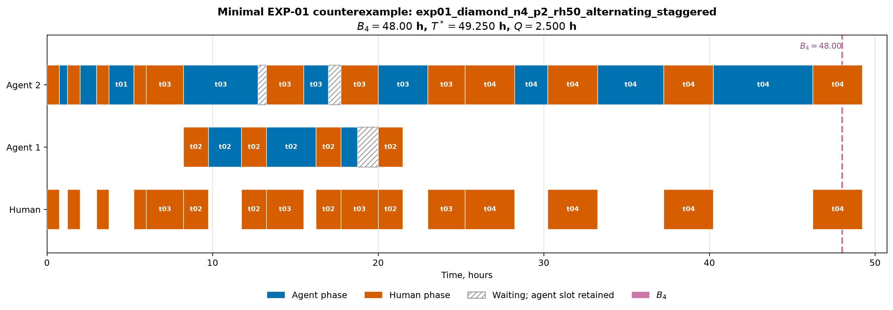

# Отчёт по EXP-01: точность $B_4$ и роль очереди

Дата отчёта: 2026-08-07

Статус: полная замороженная матрица, 90 точек.

## 1. Резюме

Все 90 точек решены CP-SAT до статуса `OPTIMAL`. Контрпримеры с
$T^*>B_4$ найдены в 30 точках. Максимальный
относительный разрыв равен 18.333%
в сценарии `exp01_independent_n4_p2_rh50_alternating_sync`.

Эксперимент подтверждает, что $B_4$ является структурной нижней границей, но не
универсально достижимым сроком: повторные запросы к единому человеческому
ресурсу создают ресурсные цепочки и блокируют агентные слоты. Одновременно gap
baseline остаётся отдельной величиной и не должен смешиваться с разрывом
$T^*-B_4$.

## 2. Зафиксированная матрица

- топологии: chain, independent, fork--join, diamond, two-layer;
- $N\in\{4\}$;
- $P\in\{2,4\}$;
- $r_h\in\{0.10,0.25,0.50\}$;
- профили: IO, alternating-sync, alternating-staggered;
- $C=\gamma=1$;
- 90 точек, random seed 0, один worker, лимит 60 секунд на точку.

Исходная матрица содержала 270 точек с $N\in\{4,8,12\}$. После 76
доказанных точек первый сценарий
`exp01_independent_n8_p2_rh25_alternating_sync` завершился со статусом
`FEASIBLE` на общем 60-секундном лимите. По заранее объявленному правилу размер
был уменьшен глобально до $N=4$; индивидуальный лимит не увеличивался. Исходная
матрица и запись остановки сохранены как pilot-артефакты.

Веса задач повторяют цикл 6, 12, 18 и 24 часа. Sync и staggered имеют одинаковые
DAG, $A$, $H$, $W_4$, $L_4$ и четыре human-запроса на задачу. Отличаются только
длительности трёх agent-сегментов: равные доли против циклической перестановки
долей $1/6$, $2/6$, $3/6$.

## 3. Основные результаты

| Профиль | Точек | $T^*>B_4$ | Медианный tightness gap, % | Максимальный gap, % | Медианный gap baseline, % |
|---|---:|---:|---:|---:|---:|
| io | 30 | 9 | 0.000 | 15.000 | 0.000 |
| alternating_sync | 30 | 12 | 0.000 | 18.333 | 0.000 |
| alternating_staggered | 30 | 9 | 0.000 | 15.000 | 0.000 |

Граница достигнута в 18 из 18 цепочечных точек и
в 42 из 72 точек остальных топологий. Это позволяет
проверить гипотезу о большей достижимости $B_4$ на цепочках без подбора матрицы
после просмотра результатов.

## 4. Tightness gap и эвристический gap


[SVG-версия](../figures/exp01_gaps.svg).

Левая панель показывает $100(T^*/B_4-1)$ — свойство границы и экземпляра.
Правая панель показывает $100(T(\pi_{base})/T^*-1)$ — потерю конкретной
политики планирования. Нулевая точка слева не означает оптимальности baseline,
а большой gap baseline не доказывает неточность $B_4$.

В 30 контролируемых парах sync/staggered синхронный профиль дал
больший tightness gap в 10 случаях, меньший — в 0,
одинаковый — в 20. Полные парные результаты сохранены отдельно и
не агрегируются с IO, где другое число human-запросов.

## 5. Выбранный контрпример

По заранее зафиксированному порядку `(task_count, total_work, scenario_id)`
для иллюстрации выбран `exp01_diamond_n4_p2_rh50_alternating_staggered`:

- топология: `diamond`;
- $N=4$, $P=2$,
  $r_h=0.50$;
- профиль: `alternating_staggered`;
- $B_4=48.00$ ч;
- $T^*=49.250$ ч;
- абсолютный разрыв: 1.250 ч;
- относительный разрыв: 2.604%;
- очередь точного расписания: 2.500 агент-часа.



[SVG-версия](../figures/exp01_counterexample_gantt.svg) и
[машиночитаемое расписание](exp01_counterexample.json).

Пунктирная линия отмечает $B_4$. Разница между ней и фактическим завершением
возникает из-за ресурсного порядка повторных human-фаз и удержания агентных
слотов во время ожиданий. Это дополнительная ресурсная критическая цепочка,
которой нет в трёх агрегатных ветвях $B_4$.

## 6. Воспроизводимость

```bash
cd simple_model_full/experiments
uv sync --python 3.13
uv run pytest -ra
uv run python -m experiments run --experiment EXP-01
```

Артефакты:

- [замороженная матрица](../scenarios/canonical/exp01_matrix.yaml);
- [исходная pilot-матрица на 270 точек](../scenarios/canonical/exp01_matrix_270_pilot.yaml);
- [запись срабатывания лимита](../scenarios/canonical/exp01_pilot_limit.json);
- [все 90 точных прогонов](exp01_runs.csv);
- [30 пар sync/staggered](exp01_profile_pairs.csv);
- [выбранный контрпример](exp01_counterexample.json);
- [manifest](exp01_manifest.json).

## 7. Ограничения

- Веса и человеческие доли синтетические и не являются оценками реальной
  команды.
- Рассматриваются детерминированные длительности, один человек и локальная
  блокировка без переиспользования занятого слота.
- Использован один цикл весов и по одному детерминированному DAG каждого типа.
- Результат показывает существование и частоту разрыва на заявленной матрице,
  но не задаёт распределение эффекта на случайных графах.

## 8. Вывод

EXP-01 отделяет два механизма: недостижимость структурной границы из-за
ресурсной критической цепочки и потерю выбранной эвристики относительно
доказанного оптимума. Результаты пока остаются в каталоге экспериментов и в
текст статьи не вносятся.
