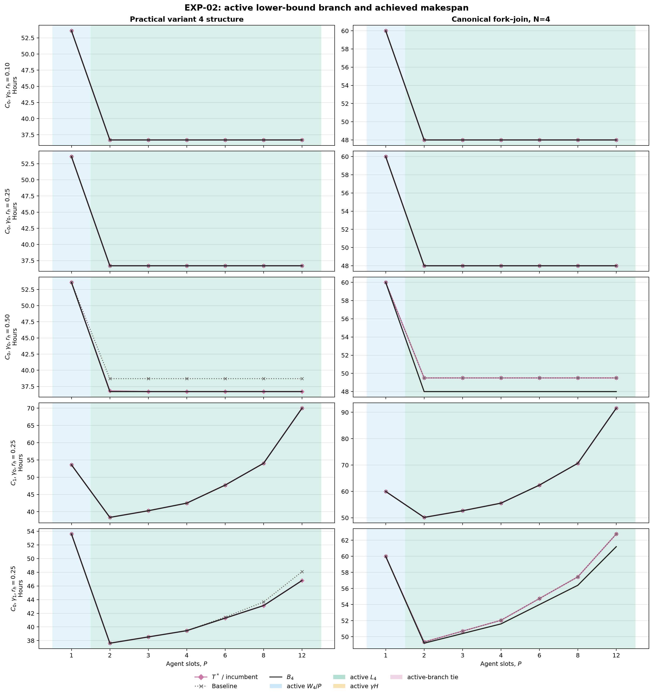

# Отчёт по EXP-02: масштабирование по числу агентов

Дата отчёта: 2026-08-07

Статус: полная замороженная матрица, 70 уникальных точек.

## 1. Резюме

До статуса `OPTIMAL` доказаны 70 из 70 точек. Exact и
baseline сохранены раздельно; ни один результат `FEASIBLE` не обозначается как
$T^*$. Максимальный доказанный разрыв $T^*/B_4-1$ равен
3.125% в сценарии
`exp02_fork_join_n4_c0_g0_rh50_p12`.

Эксперимент показывает три разных механизма формы кривой: насыщение на
критическом пути или человеческом ресурсе при $C_0,\gamma_0$, рост агентной
работы при $C_1$ и рост длительности человеческих фаз при $\gamma_1$. Активная
ветвь $B_4$ и фактический оптимум сообщаются отдельно, поскольку очередь может
оставлять положительный tightness gap.

## 2. Зафиксированный дизайн

- объекты: структура практического варианта 4 и канонический fork--join при
  $N=4$ с весами 6, 12, 18 и 24;
- для fork--join зафиксирован профиль `alternating-sync` из EXP-01;
- $P\in\{1,2,3,4,6,8,12\}$;
- уникальные режимы: три значения $r_h$ при $C_0,\gamma_0$, один срез
  $C_1,\gamma_0,r_h=0.25$ и один срез $C_0,\gamma_1,r_h=0.25$;
- $C_1(P)=1+0.05(P-1)+0.005P(P-1)$;
- $\gamma_1(P)=1+0.10(P-1)$;
- один worker, seed 0, общий лимит 60 секунд на точку.

Практический объект сохраняет DAG, $Z_i$ и полную работу $k_i$ варианта 4, но
доли $r_h$ пересобраны по общему правилу матрицы. Поэтому его часы являются
сценарной чувствительностью структуры примера, а не новой эмпирической оценкой.
Центральная точка $C_0,\gamma_0,r_h=0.25$ общая для двух срезов и не дублируется.

## 3. Кривая чистого масштабирования


[SVG-версия](../figures/exp02_scaling_curve.svg).

На рисунке соединены только точки одного режима
$C_0,\gamma_0,r_h=0.25$ и одной политики. Три цветные пунктирные линии — ветви
$W_4/P$, $L_4$ и $\gamma H$; чёрная линия — их максимум $B_4$; отдельно
показаны доказанный $T^*$ и срок фиксированной baseline-политики.

## 4. Активные ограничения и конечные минимумы



[SVG-версия](../figures/exp02_active_constraints.svg).

Фон каждой точки кодирует активную ветвь нижней границы. Каждая малая панель
содержит только один набор $C$, $\gamma$, $r_h$ и `policy_id`, поэтому линии не
смешивают разные сценарные условия.

| Объект | Режим | $P$ для min $B_4$ | $P$ для min $T^*$ | $P$ baseline | Внутренний минимум $T^*$ | Переходы активной ветви |
|---|---|---:|---:|---:|---|---|
| practical_v4 | c0_g0_rh10 | 2 | 2 | 2 | нет | P1:work;P2:critical_path |
| practical_v4 | c0_g0_rh25 | 2 | 2 | 2 | нет | P1:work;P2:critical_path |
| practical_v4 | c0_g0_rh50 | 2 | 3 | 2 | нет | P1:work;P2:critical_path |
| practical_v4 | c1_g0_rh25 | 2 | 2 | 2 | да | P1:work;P2:critical_path |
| practical_v4 | c0_g1_rh25 | 2 | 2 | 2 | да | P1:work;P2:critical_path |
| fork_join_n4 | c0_g0_rh10 | 2 | 2 | 2 | нет | P1:work;P2:critical_path |
| fork_join_n4 | c0_g0_rh25 | 2 | 2 | 2 | нет | P1:work;P2:critical_path |
| fork_join_n4 | c0_g0_rh50 | 2 | 2 | 2 | нет | P1:work;P2:critical_path |
| fork_join_n4 | c1_g0_rh25 | 2 | 2 | 2 | да | P1:work;P2:critical_path |
| fork_join_n4 | c0_g1_rh25 | 2 | 2 | 2 | да | P1:work;P2:critical_path |

Под «внутренним минимумом» понимается минимум не на правой границе сетки, после
которого доказанный срок к $P=12$ вырос больше tolerance. Обнаруженные случаи:

- `practical_v4`, `c1_g0_rh25`: $P^*=2$, $T^*=38.35150$ ч; при $P=12$ срок на 31.65375 ч больше минимума.
- `practical_v4`, `c0_g1_rh25`: $P^*=2$, $T^*=37.61750$ ч; при $P=12$ срок на 9.17500 ч больше минимума.
- `fork_join_n4`, `c1_g0_rh25`: $P^*=2$, $T^*=50.16000$ ч; при $P=12$ срок на 41.40000 ч больше минимума.
- `fork_join_n4`, `c0_g1_rh25`: $P^*=2$, $T^*=49.35000$ ч; при $P=12$ срок на 13.42500 ч больше минимума.

Полные предельные выигрыши $\Delta_P=T(P)-T(P_{next})$ сохранены для exact и
baseline в основной таблице. Отрицательное значение означает ухудшение при
переходе к следующему заранее заданному числу агентов.

## 5. Загрузка ресурсов

Для каждого расписания сохранены три разные величины:

- productive agent utilization — доля ёмкости $P\,T$, занятая agent-фазами;
- agent-slot utilization — доля ёмкости, в которой слот удерживается задачей,
  включая human-фазы и ожидание;
- human utilization — занятость единственного человеческого ресурса.

Также сохранены суммарное ожидание, время хотя бы одной блокировки и
максимальное число одновременно ожидающих human-фаз. Эти показатели не
включаются в $W_4$, $L_4$ или $B_4$.

## 6. Воспроизводимость

```bash
cd simple_model_full/experiments
uv sync --python 3.13
uv run pytest -ra
uv run python -m experiments run --experiment EXP-02
```

Артефакты:

- [замороженная матрица](../scenarios/canonical/exp02_matrix.yaml);
- [все 70 прогона](exp02_runs.csv);
- [минимизирующее число агентов и переходы режимов](exp02_optimal_p.csv);
- [manifest](exp02_manifest.json).

## 7. Ограничения

- $C_1$, $\gamma_1$ и значения $r_h$ — синтетические уровни чувствительности,
  а не оценки реальной команды.
- Исследованы два фиксированных DAG; результат не является распределением по
  семейству графов.
- Длительности детерминированы, человеческий ресурс имеет мощность 1, а
  ожидающая задача локально удерживает агентный слот.
- Минимум на конечной сетке не доказывает оптимальность для всех целых $P$ вне
  $\{1,2,3,4,6,8,12\}$.

## 8. Вывод

EXP-02 даёт воспроизводимую кривую масштабирования, явно разделяет структурную
границу, точный makespan и baseline и проверяет наличие конечного оптимума на
заранее объявленных уровнях накладных расходов. Результаты остаются в каталоге
экспериментов и пока не вносятся в текст статьи.
