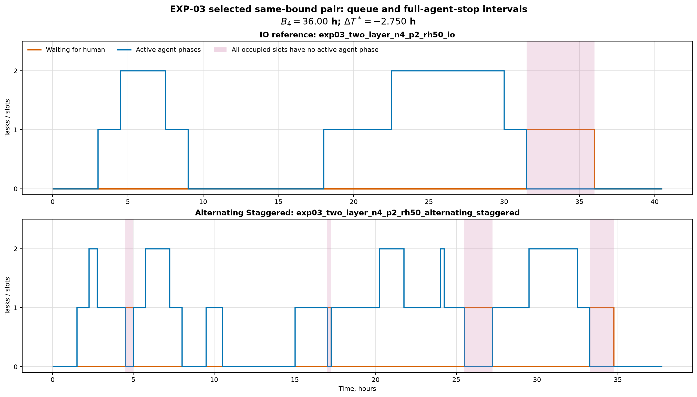

# Отчёт по EXP-03: расположение человеческих фаз

Дата отчёта: 2026-08-07

Статус: полная замороженная матрица, 32 точки и 24 парных
сравнения с IO.

## 1. Резюме

Для 32 из 32 точек доказан статус `OPTIMAL`. Во всех
парах сохранены DAG, $A$, $H$, $W_4$, $L_4$, $C$, $\gamma$ и $B_4$; меняются
только расположение human-фаз и, для alternating-профилей, число запросов.

Найдены 14 из 24 пар с одинаковым $B_4$ и
разным доказанным $T^*$. По заранее зафиксированному правилу максимального
$|\Delta T^*|$ выбрана пара `two_layer_p2_rh50_alternating_staggered_vs_io`:

- $B_4=36.00$ ч;
- $T^*_{IO}=40.500$ ч;
- $T^*_{profile}=37.750$ ч;
- $\Delta T^*=-2.750$ ч;
- $\Delta Q=-0.500$ агент-часа;
- изменение времени полной остановки всех слотов:
  -0.500 ч.

Таким образом, критерий содержательного результата EXP-03 выполнен: одинаковые
$A$, $H$, $W_4$, $L_4$ и $B_4$ не определяют фактический оптимум без
расположения human-фаз.

## 2. Зафиксированный дизайн

- DAG: fork--join и two-layer из замороженного EXP-01, $N=4$;
- $P\in\{2,4\}$, $r_h\in\{0.25,0.50\}$;
- профили: IO (50/50 human-времени), front-loaded (90/10),
  alternating-sync и alternating-staggered;
- $C_0=\gamma_0=1$;
- IO используется как reference внутри каждой пары;
- exact: один worker, seed 0, общий лимит 60 секунд на точку.

IO и front-loaded содержат по два human-запроса на задачу. Alternating-профили
содержат по четыре; sync делит agent-время одинаково, staggered циклически
переставляет доли $1/6$, $2/6$, $3/6$.

В 4 из 8 сравнений front-loaded/IO доказанный оптимум
различается при одинаковом числе запросов. Следовательно, наличие эффекта нельзя
объяснить только удвоением числа human-фаз в alternating-профилях.

## 3. Парные эффекты относительно IO


[SVG-версия](../figures/exp03_profile_effects.svg).

| Профиль | Пар | $\Delta T^*\ne0$ | Меньше IO | Больше IO | Медиана $\Delta T^*$ | Min | Max | Медиана $\Delta Q$ | Медиана изменения полной остановки |
|---|---:|---:|---:|---:|---:|---:|---:|---:|---:|
| front_loaded | 8 | 4 | 2 | 2 | 0.000 | -0.900 | 0.300 | 0 | 0 |
| alternating_sync | 8 | 6 | 4 | 2 | -0.750 | -1.750 | 0.750 | 0.750 | 0 |
| alternating_staggered | 8 | 4 | 4 | 0 | -0.875 | -2.750 | 0.000 | 0 | 0 |

Отрицательное $\Delta T^*$ означает, что профиль завершает тот же DAG быстрее
IO; положительное — медленнее. Эти эффекты не смешиваются с gap baseline:
соответствующие разности фиксированной политики сохранены отдельными столбцами.

В 8 прямых парах sync/staggered совпадают также число и
размер human-фаз. Sync дал больший $T^*$ в 6 случаях, меньший — в
0, одинаковый — в 2. Полные результаты сохранены в
[отдельной таблице](exp03_sync_staggered_pairs.csv).

## 4. Очередь и полная остановка слотов



[SVG-версия](../figures/exp03_queue_blocking.svg).

На timeline показана пара `two_layer_p2_rh50_alternating_staggered_vs_io`. Оранжевая
ступенчатая линия — число задач, ожидающих человеческий ресурс; синяя — число
выполняемых agent-фаз. Розовый фон отмечает интервалы, когда все $P$ слотов
удерживаются задачами, но ни на одном не выполняется agent-фаза. Это
операционное определение «полной остановки» зафиксировано до запуска.

Blocked agent-time совпадает с площадью под длиной human-очереди и с $Q$ по
контракту модели. Время с хотя бы одной блокировкой считается как длина
объединения интервалов ожидания и хранится отдельно от суммы ожиданий.

## 5. Воспроизводимость

```bash
cd simple_model_full/experiments
uv sync --python 3.13
uv run pytest -ra
uv run python -m experiments run --experiment EXP-03
```

Артефакты:

- [замороженная матрица](../scenarios/canonical/exp03_matrix.yaml);
- [все 32 прогона](exp03_runs.csv);
- [24 парных сравнения](exp03_profile_pairs.csv);
- [8 прямых пар sync/staggered](exp03_sync_staggered_pairs.csv);
- [фазы и интервалы ожидания](exp03_phases.csv);
- [временные состояния ресурсов и очереди](exp03_events.csv);
- [выбранная пара](exp03_counterexample.json);
- [manifest](exp03_manifest.json).

## 6. Ограничения

- Параметры и веса синтетические; исследованы только два фиксированных DAG.
- Длительности детерминированы, человек имеет мощность 1, ожидающая задача
  удерживает агентный слот.
- CP-SAT минимизирует makespan, но не использует очередь как вторичную цель.
  Поэтому exact-метрики очереди описывают детерминированно возвращённое
  оптимальное расписание при одном worker и seed 0, а не минимум очереди среди
  всех расписаний с тем же $T^*$.
- Разность между alternating и IO одновременно включает изменение числа
  human-запросов; чистое влияние синхронизации оценивается сравнением sync и
  staggered в отдельной таблице результатов, а не сравнением с IO в изоляции.

## 7. Вывод

EXP-03 проверяет фазовый механизм без изменения агрегатной работы и нижней
границы. Результаты остаются в каталоге экспериментов и пока не вносятся в
текст статьи.
