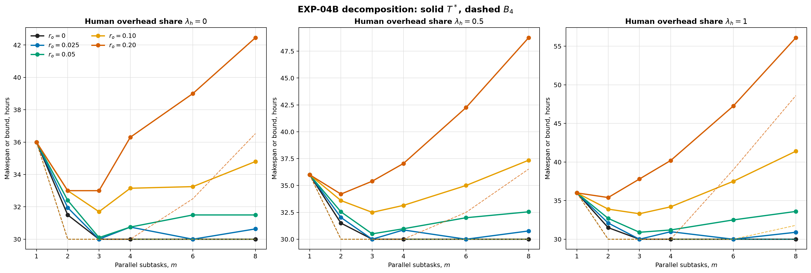
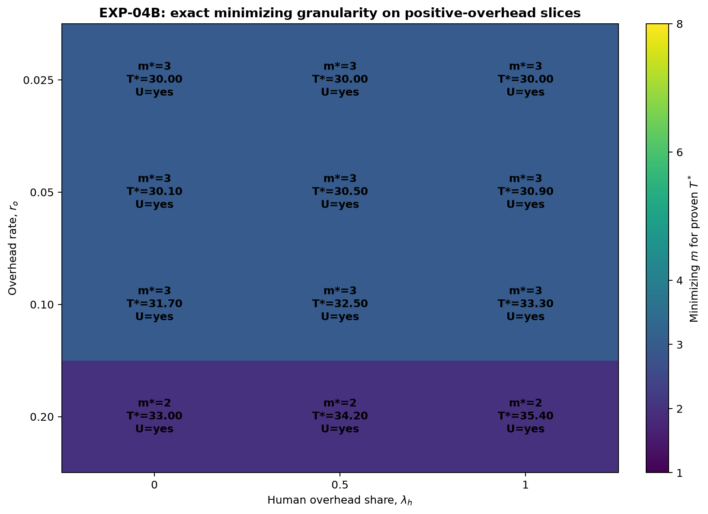

# Отчёт по EXP-04: контролируемая декомпозиция

Дата отчёта: 2026-08-07

Статус: EXP-04A оформлен из доказанных результатов EXP-00; EXP-04B выполнен на
66 уникальных сценариях и 13 кривых параметров.

## 1. Резюме

Все 66 из 66 уникальных точек EXP-04B доказаны как
`OPTIMAL`. Внутренний U-образный минимум доказанного $T^*$ обнаружен в
12 из 13 кривых. Нулевой overhead даёт минимизирующее
$m=3$ и $T^*=30.00000$ ч.

Практическая пара EXP-04A подтверждает только структурное сокращение
$43.2\to36.7$ ч при нулевом overhead. Она не используется как доказательство
общей U-образной зависимости.

## 2. Зафиксированный оператор EXP-04B

- база: two-layer $N=4$, $P=4$, IO, $r_h=0.25$;
- декомпозируется критическая sink-вершина `t04` с усилием 24 ч;
- её входная human-фаза и agent-работа делятся между $m$ параллельными
  подзадачами, финальная приёмка переносится на join;
- полный overhead равен $(m-1)r_o\cdot24$;
- половина overhead распределяется поровну по входам подзадач, половина
  добавляется на join; $\lambda_h$ задаёт human-долю;
- исходный quality gate `qg_t04` сохраняется на join;
- $m\in\{1,2,3,4,6,8\}$, $r_o\in\{0,0.025,0.05,0.10,0.20\}$,
  $\lambda_h\in\{0,0.5,1\}$.

Из 90 комбинаций получено 66 уникальных сценариев. При $m=1$ overhead равен
нулю для всех $r_o,\lambda_h$; при $r_o=0$ три значения $\lambda_h$ также
совпадают. Для построения 13 содержательных кривых общая точка $m=1$
переиспользуется, поэтому на рисунке 78 позиций, но только 66 решений.

## 3. Практическое сравнение EXP-04A

| Вариант | Уровень декомпозиции | $L_4$ | $B_4$ | $T^*$ | Изменение к варианту 3 |
|---|---:|---:|---:|---:|---:|
| 3 | 0 | 43.20 | 43.20 | 43.20 | 0.00 |
| 4 | 1 | 36.700 | 36.700 | 36.70 | -6.50 |

## 4. U-кривые точного makespan



[SVG-версия](../figures/exp04_decomposition_curves.svg).

Сплошные линии показывают только доказанный $T^*$, пунктирные — $B_4$.
Нулевой overhead сообщается отдельно; три панели разделяют агентный, смешанный
и человеческий overhead и не соединяют разные $r_o$ или $\lambda_h$.

## 5. Оптимальная гранулярность



[SVG-версия](../figures/exp04_optimal_granularity.svg).

| $r_o$ | $\lambda_h$ | $m$ для min $B_4$ | $m$ для min $T^*$ | $m$ baseline | Min $T^*$ | U у $T^*$ | $T^*(8)-\min T^*$ |
|---:|---:|---:|---:|---:|---:|---|---:|
| 0 | shared | 2 | 3 | 3 | 30.00000 | нет | 0.00000 |
| 0.025 | 0 | 2 | 3 | 3 | 30.00000 | да | 0.63750 |
| 0.025 | 0.5 | 2 | 3 | 3 | 30.00000 | да | 0.76875 |
| 0.025 | 1 | 2 | 3 | 3 | 30.00000 | да | 0.90000 |
| 0.05 | 0 | 2 | 3 | 3 | 30.10000 | да | 1.40000 |
| 0.05 | 0.5 | 2 | 3 | 3 | 30.50000 | да | 2.05000 |
| 0.05 | 1 | 2 | 3 | 3 | 30.90000 | да | 2.70000 |
| 0.10 | 0 | 2 | 3 | 3 | 31.70000 | да | 3.10000 |
| 0.10 | 0.5 | 2 | 3 | 3 | 32.50000 | да | 4.85000 |
| 0.10 | 1 | 2 | 3 | 3 | 33.30000 | да | 8.10000 |
| 0.20 | 0 | 2 | 2 | 2 | 33.00000 | да | 9.45000 |
| 0.20 | 0.5 | 2 | 2 | 2 | 34.20000 | да | 14.55000 |
| 0.20 | 1 | 2 | 2 | 2 | 35.40000 | да | 20.70000 |

U-образность считается подтверждённой только если минимум $T^*$ лежит внутри
сетки, а значения при $m=1$ и $m=8$ превышают его больше tolerance. Минимум
только у $B_4$ или baseline таким результатом не считается.

## 6. Трассировка overhead и расписаний

Для каждой точки сохранены total/human/agent overhead, $W_4$, $H$, $L_4$,
очередь, полная остановка слотов и реализованная exact critical chain. Проверки
требуют тождеств $W_4-W_4^{useful}=overhead$ и
$H-H^{useful}=\lambda_h\,overhead$. При $r_o=0$ полезная agent- и
human-работа сохраняются точно для любого $m$.

## 7. Воспроизводимость

```bash
cd simple_model_full/experiments
uv sync --python 3.13
uv run pytest -ra
uv run python -m experiments run --experiment EXP-04
```

Артефакты:

- [замороженная матрица](../scenarios/canonical/exp04_matrix.yaml);
- [EXP-04A](exp04a_summary.csv);
- [66 точных прогонов EXP-04B](exp04b_runs.csv);
- [оптимальная гранулярность](exp04b_optimal_m.csv);
- [фазовые трассы](exp04b_phases.csv) и [события](exp04b_events.csv);
- [manifest](exp04_manifest.json).

## 8. Ограничения

- Оператор и overhead синтетические; исследована одна критическая вершина
  одного канонического DAG.
- CP-SAT минимизирует makespan, но не очередь как вторичную цель.
- Join сохраняет полезную финальную приёмку, поэтому $m=1$ является
  семантической декомпозированной базой, а не побайтово тем же DAG.
- U-образный минимум на конечной сетке не доказывает оптимальность для всех
  целых $m$ вне $\{1,2,3,4,6,8\}$.

## 9. Вывод

EXP-04 разделяет практический структурный эффект и канонический оператор с
полностью трассируемым overhead. Результаты остаются в каталоге экспериментов и
пока не вносятся в текст статьи.
