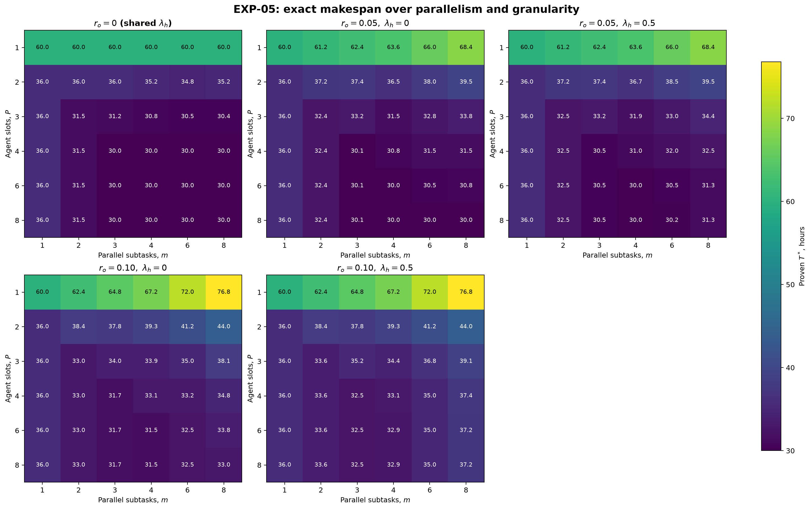
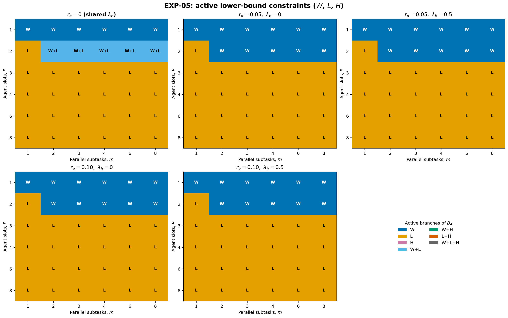

# Отчёт по EXP-05: взаимодействие параллелизма и декомпозиции

Дата отчёта: 2026-08-07

Статус: рассчитано 156 уникальных сценариев для 216
позиций исходной сетки и 180 содержательных
позиций после объединения нулевого overhead.

## 1. Резюме

Статусы exact solver: `OPTIMAL` --- 156, `FEASIBLE` ---
0, остальные --- 0. Полностью доказанный выбор
оптимального $m$ доступен для 30 из 30 срезов
$(P,r_o,\lambda_h)$.

Для положительного overhead доказанный interaction contrast вычислен в
100 внутренних ячейках $P>1,m>1$: положительных ---
96, отрицательных --- 0, нулевых в пределах tolerance
--- 4. Максимум: $I=19.80000$ ч при $P=8$, $m=8$, $r_o=0.10$, $\lambda_h=0$. Минимум: $I=0.00000$ ч при $P=2$, $m=2$, $r_o=0.05$, $\lambda_h=0$.

Положительный $I(P,m)$ означает, что выигрыш от декомпозиции при данном $P$
больше выигрыша при $P=1$. Это interaction contrast, а не самостоятельная
оценка причинного эффекта в реальном проекте.

### Интерпретация результата

- Гипотеза о взаимодополняемости подтверждена на зафиксированной сетке:
  96 из 100 внутренних контрастов положительны,
  4 равны нулю и отрицательных контрастов нет. Все четыре нулевые
  точки имеют $P=2,m=2$.
- Перенос половины overhead на человека ни в одной из 60 сопоставимых ячеек
  не усилил выигрыш от декомпозиции: он уменьшился в
  37 случаях и не изменился в 23;
  усилений --- 0. Максимальное ослабление составляет
  4.20000 ч.
- Оптимальная гранулярность зависит от $P$: при положительном overhead для
  $P=1,2$ минимизирует $m=1$, тогда как при $P=3\ldots8$ минимум переносится
  на $m=2\ldots4$ (с одним плато $m=4,6,8$).
- Нижняя граница активна по работе в 50 из 180 ячеек,
  по критическому пути в 125, одновременно по двум ветвям в
  5. При этом максимальный доказанный разрыв $T^*-B_4$ равен
  9.15000 ч в сценарии
  `exp05_p03_m08_ro100_lh05`.
- Наибольший разрыв baseline с оптимумом равен
  6.75000 ч в сценарии
  `exp05_p02_m06_ro100_lh00`. Поэтому ни $B_4$, ни baseline не
  заменяют точное расписание в выводе о взаимодействии.

## 2. Зафиксированный дизайн

- без изменения переиспользован оператор EXP-04B для вершины `t04`;
- $P,m\in\{1,2,3,4,6,8\}$;
- $r_o\in\{0,0.05,0.10\}$, $\lambda_h\in\{0,0.5\}$;
- полный overhead равен $(m-1)r_o\cdot24$ ч;
- исходные 216 позиций свёрнуты в 156 семантических сценариев;
- при анализе два совпадающих нулевых среза $\lambda_h$ объединены, поэтому
  остаётся 180 позиций и пять режимов overhead;
- первый полный проход с лимитом
  120 секунд дал 155 `OPTIMAL` и одну
  `FEASIBLE` точку; предусмотренное протоколом единственное повышение лимита
  применено ко всему блоку из 156 точек, а не к отдельному сценарию;
- итоговый проход: один worker, seed 0, лимит
  300 секунд на каждую уникальную точку.

## 3. Тепловые карты доказанного makespan



[SVG-версия](../figures/exp05_makespan_heatmaps.svg).

Пустая ячейка означает отсутствие доказанного `OPTIMAL` и не заменяется
incumbent-значением.

## 4. Interaction contrast


[SVG-версия](../figures/exp05_interaction_contrast.svg).

Определение:

$$
I(P,m)=[T^*(P,1)-T^*(P,m)]-[T^*(1,1)-T^*(1,m)].
$$

Контраст вычисляется только когда все четыре входящих значения доказаны как
`OPTIMAL`.

## 5. Активные ограничения нижней границы



[SVG-версия](../figures/exp05_active_constraints.svg).

$W$ обозначает $W_4/P$, $L$ --- $L_4$, $H$ --- $\gamma H$. Совпадающие
ветви показаны составными метками. Карта относится к $B_4$ и не выдаётся за
карту фактического makespan.

## 6. Оптимальная гранулярность

| $P$ | $r_o$ | $\lambda_h$ | Все минимизирующие $m$ по $T^*$ | Min $T^*$ | $m$ по $B_4$ | $m$ baseline |
|---:|---:|---:|---:|---:|---:|---:|
| 1 | 0 | shared | 1;2;3;4;6;8 | 60.00000 | 1 | 1 |
| 1 | 0.05 | 0 | 1 | 60.00000 | 1 | 1 |
| 1 | 0.05 | 0.5 | 1 | 60.00000 | 1 | 1 |
| 1 | 0.10 | 0 | 1 | 60.00000 | 1 | 1 |
| 1 | 0.10 | 0.5 | 1 | 60.00000 | 1 | 1 |
| 2 | 0 | shared | 6 | 34.75000 | 2 | 1 |
| 2 | 0.05 | 0 | 1 | 36.00000 | 2 | 1 |
| 2 | 0.05 | 0.5 | 1 | 36.00000 | 2 | 1 |
| 2 | 0.10 | 0 | 1 | 36.00000 | 2 | 1 |
| 2 | 0.10 | 0.5 | 1 | 36.00000 | 2 | 1 |
| 3 | 0 | shared | 8 | 30.37500 | 2 | 8 |
| 3 | 0.05 | 0 | 4 | 31.50000 | 2 | 2 |
| 3 | 0.05 | 0.5 | 4 | 31.95000 | 2 | 2 |
| 3 | 0.10 | 0 | 2 | 33.00000 | 2 | 2 |
| 3 | 0.10 | 0.5 | 2 | 33.60000 | 2 | 2 |
| 4 | 0 | shared | 3;4;6;8 | 30.00000 | 2 | 3 |
| 4 | 0.05 | 0 | 3 | 30.10000 | 2 | 3 |
| 4 | 0.05 | 0.5 | 3 | 30.50000 | 2 | 3 |
| 4 | 0.10 | 0 | 3 | 31.70000 | 2 | 3 |
| 4 | 0.10 | 0.5 | 3 | 32.50000 | 2 | 3 |
| 6 | 0 | shared | 3;4;6;8 | 30.00000 | 2 | 3 |
| 6 | 0.05 | 0 | 4 | 30.00000 | 2 | 4 |
| 6 | 0.05 | 0.5 | 4 | 30.00000 | 2 | 4 |
| 6 | 0.10 | 0 | 4 | 31.50000 | 2 | 4 |
| 6 | 0.10 | 0.5 | 3 | 32.50000 | 2 | 3 |
| 8 | 0 | shared | 3;4;6;8 | 30.00000 | 2 | 3 |
| 8 | 0.05 | 0 | 4;6;8 | 30.00000 | 2 | 4 |
| 8 | 0.05 | 0.5 | 4 | 30.00000 | 2 | 4 |
| 8 | 0.10 | 0 | 4 | 31.50000 | 2 | 4 |
| 8 | 0.10 | 0.5 | 3 | 32.50000 | 2 | 3 |

При наличии нескольких точных минимумов перечислены все значения $m$ в
пределах tolerance; отдельный столбец `minimizing_m_T_star` в CSV хранит
наименьшее из них для машинной обработки.

## 7. Трассировка и воспроизводимость

Для каждой уникальной точки сохранены overhead, $W_4$, $H$, $L_4$, $B_4$,
статус и bound решателя, baseline, реализованная critical chain, фазовые и
событийные трассы. Общие точки сетки восстановлены в отдельном CSV без
повторного решения.

```bash
cd simple_model_full/experiments
uv sync --python 3.13
uv run pytest -ra
uv run python -m experiments run --experiment EXP-05
```

Артефакты:

- [замороженная матрица](../scenarios/canonical/exp05_matrix.yaml);
- [156 уникальных прогонов](exp05_runs.csv);
- [216 восстановленных позиций](exp05_grid.csv);
- [interaction contrast](exp05_interactions.csv);
- [оптимальная гранулярность](exp05_optimal_m.csv);
- [фазовые трассы](exp05_phases.csv) и [события](exp05_events.csv);
- [manifest](exp05_manifest.json).

## 8. Ограничения

- Результат относится к одной синтетической вершине одного канонического DAG.
- Сетка конечна и не доказывает оптимальность вне выбранных $P$ и $m$.
- CP-SAT минимизирует makespan, но не очередь как вторичную цель.
- `FEASIBLE` incumbent хранится для аудита, но не называется $T^*$ и не входит
  в interaction contrast или доказанный выбор $m$.
- Рост $P$ не включает зависимые от масштаба $C(P)$ или $\gamma(P)$: здесь
  изолировано только взаимодействие доступных слотов и гранулярности.

## 9. Вывод

EXP-05 подтверждает на зафиксированной канонической сетке, что доступные
агентные слоты и декомпозиция являются взаимодополняющими рычагами: почти все
внутренние interaction contrast положительны, а оптимальное $m$ меняется с
$P$. Человеческая доля overhead ослабляет или сохраняет, но не усиливает
выигрыш декомпозиции в исследованных ячейках. Результаты остаются в каталоге
экспериментов и пока не вносятся в текст статьи.
