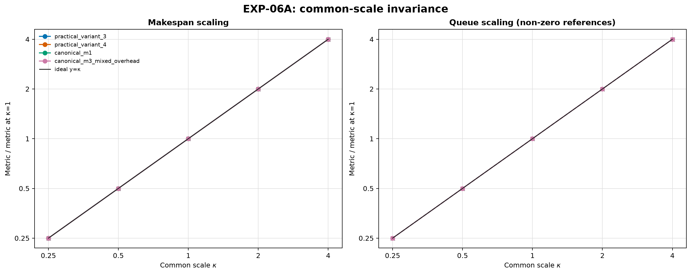
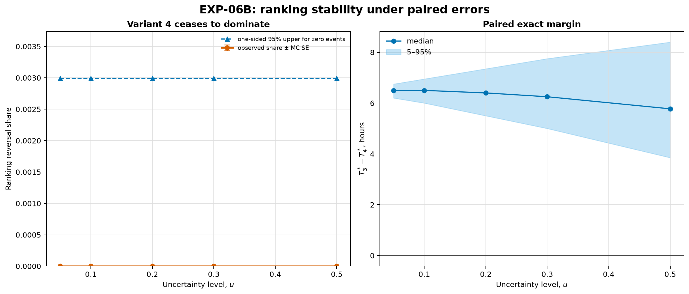
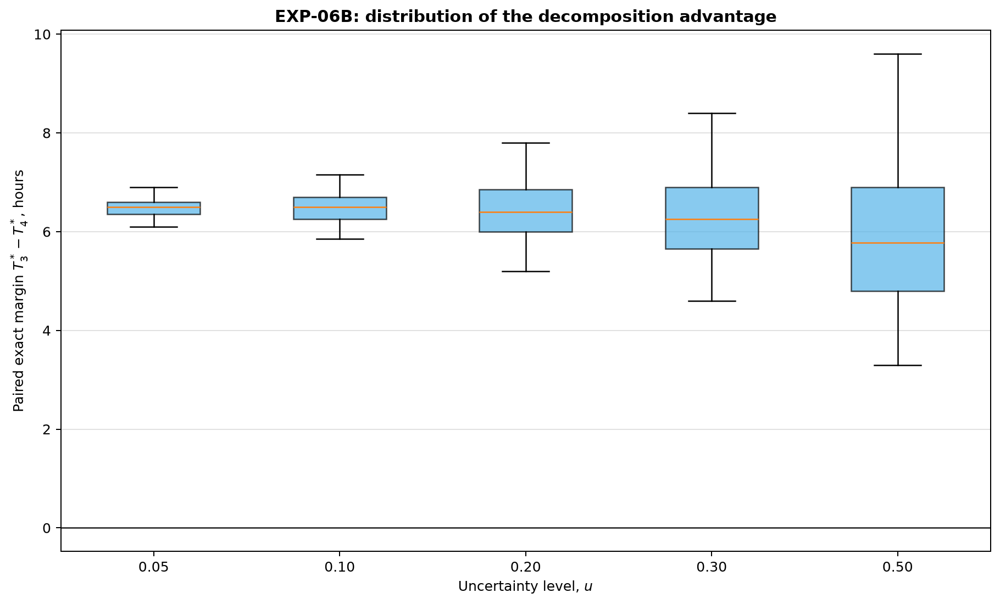
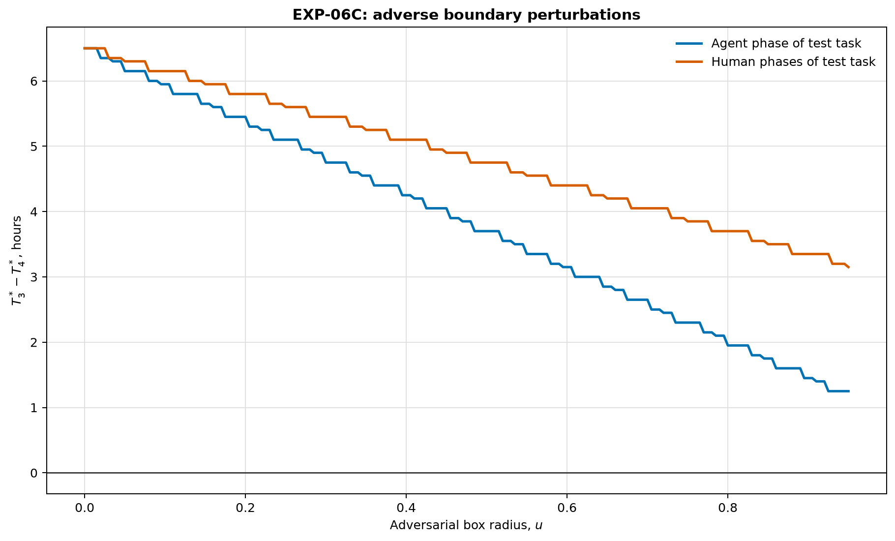

# Отчёт по EXP-06: масштаб и устойчивость ранжирования

Дата отчёта: 2026-08-07

## 1. Резюме

EXP-06A выполнил 20 масштабных точек, из них `OPTIMAL` ---
20; все заявленные линейные инварианты прошли автоматическую
проверку. EXP-06B выполнил 5000 пар (10000
точных решений), доказанные парные исходы доступны для 5000 пар.
EXP-06C выполнил 382 пар, доказанные исходы доступны для
382.

Общая шкала не изменила ранжирование и безразмерные показатели, но этот
результат не переносится автоматически на относительные ошибки. Случайные и
adversarial-результаты ниже относятся только к зафиксированной модели ошибок.

В EXP-06B не наблюдалось ни одной смены ранжирования на 5000 доказанных пар.
Это не означает нулевую вероятность: для каждого уровня с 0 событиями из 1000
one-sided 95% верхняя граница равна примерно 0.003. Минимальный доказанный
запас $T_3^*-T_4^*$ на максимальном уровне $u=0.50$ остался положительным и
составил 3.30 ч.

## 2. EXP-06A: общая шкала



[SVG-версия](../figures/exp06_scale_invariance.svg).

Проверены практические варианты 3--4 и две заранее выбранные канонические
точки при $\kappa\in\{0.25,0.5,1,2,4\}$. Одновременно масштабировались
$x$, длительности фаз, time unit и tolerance; топология, quality gates и
безразмерные коэффициенты не менялись. Дискретная модель решателя в ticks
оставалась идентичной.

## 3. EXP-06B: парные случайные ошибки



[SVG-версия](../figures/exp06_ranking_stability.svg).



[SVG-версия](../figures/exp06_margin_distributions.svg).

| $u$ | Доказанных пар | Смен ранжирования | Доля | MC SE | 95% upper при 0 событиях | Медиана $T_3^*-T_4^*$ | q05 | q95 |
|---:|---:|---:|---:|---:|---:|---:|---:|---:|
| 0.05 | 1000 | 0 | 0 | 0.0 | 0.002991 | 6.50 | 6.20 | 6.75 |
| 0.10 | 1000 | 0 | 0 | 0.0 | 0.002991 | 6.50 | 6.00 | 6.95 |
| 0.20 | 1000 | 0 | 0 | 0.0 | 0.002991 | 6.40 | 5.50 | 7.35 |
| 0.30 | 1000 | 0 | 0 | 0.0 | 0.002991 | 6.25 | 5.00 | 7.75 |
| 0.50 | 1000 | 0 | 0 | 0.0 | 0.002991 | 5.775 | 3.85 | 8.40 |

Множители agent- и human-частей выбираются независимо и равномерно в log-space
между $\log(1-u)$ и $\log(1+u)$. Неизменённые задачи получают одинаковые
множители в обоих вариантах. Задачи 6a--6c наследуют общий множитель задачи 6
и меньший residual с log-scale 0.25. Все применённые
множители сохранены отдельно.

## 4. EXP-06C: неблагоприятные ошибки



[SVG-версия](../figures/exp06_adversarial_thresholds.svg).

| Режим | Доказанных пар | Пересечение найдено | Min $u$ | Margin при пересечении | Margin при $u=0$ | Margin при $u=0.95$ |
|---|---:|---|---:|---:|---:|---:|
| critical_task_agent | 191 | false |  |  | 6.50 | 1.25 |
| test_human_phases | 191 | false |  |  | 6.50 | 3.15 |

В каждом режиме вариант 3 получает множитель $1-u$ на выбранном ресурсе задачи
6, а 6a--6c варианта 4 --- $1+u$. Остальные задачи и ресурсы не меняются.
Из-за монотонности makespan по длительностям это граничная неблагоприятная
точка внутри зафиксированного семейства, но не глобальный adversarial-анализ
произвольных ошибок всех коэффициентов.

На сетке до $u=0.95$ пересечение не найдено. Запас сократился с 6.50 до
1.25 ч для agent-фазы критической тестовой задачи и до 3.15 ч для её human-фаз.

## 5. Воспроизводимость

```bash
cd simple_model_full/experiments
uv sync --python 3.13
uv run pytest -ra
uv run python -m experiments run --experiment EXP-06
```

Артефакты:

- [замороженная матрица](../scenarios/canonical/exp06_matrix.yaml);
- [EXP-06A](exp06a_scale.csv), [фазы](exp06a_phases.csv) и [события](exp06a_events.csv);
- [EXP-06B пары](exp06b_pairs.csv), [множители](exp06b_multipliers.csv) и [агрегаты](exp06b_summary.csv);
- [EXP-06C сетка](exp06c_pairs.csv) и [пороги](exp06c_summary.csv);
- [manifest](exp06_manifest.json).

## 6. Ограничения

- Распределение ошибок синтетическое и не является эмпирическим доверительным
  интервалом.
- Квантование к исходному time unit делает результаты воспроизводимыми, но
  дискретизирует малые ошибки.
- EXP-06B относится к одной паре практических DAG и одной корреляционной
  структуре ошибок.
- EXP-06C проверяет два заранее заданных неблагоприятных направления, а не всю
  многомерную box-область.
- CP-SAT минимизирует makespan, но не очередь как вторичную цель.

## 7. Вывод

EXP-06 отделяет точную масштабную инвариантность ядра от условной устойчивости
ранжирования к относительным ошибкам. В зафиксированной модели ошибок вариант
4 сохранил преимущество во всех 5000 случайных парах и во всех 382 граничных
adversarial-парах, но этот результат не обобщается на другие распределения и
направления ошибок. Результаты остаются в каталоге экспериментов и пока не
вносятся в текст статьи.
