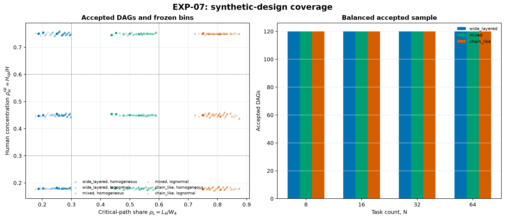

# EXP-07: устойчивость к синтетической топологии

## Постановка

EXP-07 проверяет четыре заранее замороженных направления эффектов на 1440
сценариях: 480 общих основ «граф плюс веса» повторяются для трёх размещений
human-work. Пилот стратифицирован по `N`, семейству графа, типу весов и
концентрации человеческой работы. На каждую из 72 ячеек
получено ровно 20 принятых seed; отклонённые попытки не считаются наблюдениями.
Bootstrap перевыбирает общие структурные основы, сохраняя связанные размещения
в одном кластере.

Важное ограничение дизайна: семейства `wide_layered`, `mixed` и `chain_like`
заранее соответствуют low, medium и high корзинам $\rho_L$. Поэтому различия
между корзинами $\rho_L$ нельзя отделить от различий семейств графа.

## Генерация и воспроизводимость

- принятых сценариев: **1440** на **480** структурных основах;
- отклонённых попыток rejection sampling: **405**;
- размеры: 8, 16, 32 и 64 задачи;
- веса: homogeneous и дискретизированные lognormal (`sigma=0.55`);
- все принятые графы ацикличны, слабо связны, достижимы из source и лежат
  в целевых корзинах $\rho_L$ и $\rho_H^{cp}$;
- `exp07_dags.csv` хранит сырой seed, рёбра, веса, human shares, критический
  путь и причину принятия; `exp07_generation_attempts.csv` хранит также отказы.

[SVG-версия](../figures/exp07_design_coverage.svg).

## Confirmatory-результаты

На полной выборке `T` означает makespan заранее фиксированной политики
`bottom_level_fcfs_v1`, а не оптимум. $T^*$ используется только для строк exact
со статусом `OPTIMAL`.

| Claim | Metric | Estimator | n (clusters) | Center [95% cluster bootstrap] | Decision |
|---|---|---:|---:|---:|---|
| C1 | `delta_tightness_sync_minus_staggered` | `baseline_policy` | 1440 (480) | -0.0022 [-0.0026, -0.0011] | **not_supported** |
| C2 | `delta_policy_optimal_p_agent_cost` | `baseline_policy` | 1440 (480) | 0.0000 [0.0000, 0.0000] | **supported** |
| C2 | `delta_policy_optimal_p_human_cost` | `baseline_policy` | 1440 (480) | 0.0000 [0.0000, 0.0000] | **supported** |
| C3 | `decomposition_interaction` | `baseline_policy` | 1440 (480) | 6.4000 [6.0000, 6.8000] | **supported** |
| C3 | `overhead_attenuation` | `baseline_policy` | 1440 (480) | 2.0000 [2.0000, 2.0000] | **supported** |
| C4 | `delta_human_active_high_minus_low` | `lower_bound` | 480 (480) | -0.1833 [-0.2396, -0.1291] | **not_supported** |

Итог по полной policy/lower-bound выборке:

- **Исходный confirmatory-критерий C1 не подтверждён:** медианный contrast
  равен -0.00217, 95% cluster-bootstrap interval [-0.00261, -0.00108]. Профиль,
  обозначенный в frozen matrix как `alternating_sync`, немного уменьшает, а не
  сохраняет или увеличивает policy-tightness относительно
  `alternating_staggered`.
- **C2 подтверждён:** медианный сдвиг policy-optimal P равен нулю для обеих
  cost curves; доля сдвигов в запрещённую положительную сторону равна 0.0042
  для agent-cost и 0.0063 для human-cost, ниже замороженного порога 0.05.
- **C3 подтверждён:** медиана interaction равна 6.4, медиана attenuation от
  overhead равна 2.0. Отрицательные индивидуальные contrasts не скрыты.
- **C4 не подтверждён:** частота human-active branch снизилась с 0.3458 в low
  stratum до 0.1625 в high; средний paired contrast равен -0.1833.

[SVG-версия](../figures/exp07_claim_effects.svg).

## Ретроспективная интерпретация C1

Этот раздел добавлен после просмотра результатов и не меняет confirmatory-
решение `not_supported`. Название `alternating_sync` оказалось содержательно
неточным: генератор не выравнивал human-фазы разных задач по wall-clock. В
обоих профилях каждая задача имела четыре одинаковые human-фазы $H_i/4$ и
запускалась согласно DAG и доступности ресурсов, поэтому глобальной
синхронизации человеческих запросов не было ни в одном treatment.

Фактически treatments различались только внутренним разбиением agent-work.
В `alternating_sync` три agent-отрезка задачи равны $A_i/3$; в
`alternating_staggered` они имеют длины $A_i\{1/6,2/6,3/6\}$, циклически
переставленные между задачами. Следовательно, C1 сравнил более регулярный и
более нерегулярный **асинхронные** профили. Небольшое преимущество первого
варианта становится интуитивно объяснимым, но это post hoc объяснение нельзя
выдавать за подтверждение влияния настоящей синхронизации. Для такого вывода
нужен отдельный дизайн с явно совпадающими wall-clock окнами human-фаз.

## Exact-аудит

Exact-подвыборка заморожена до расчётов: `N=8/16`, homogeneous-веса, средняя
концентрация human-work, seed 0 и 1 для каждого семейства — 12 DAG. После
зафиксированной до просмотра исходов ресурсной поправки для C1 и baseline-gap
рассчитано 36 сценариев. Статусы: **{"FEASIBLE": 18, "OPTIMAL": 18}**.
Ни один FEASIBLE incumbent не обозначается как $T^*$ и не входит в proven
paired contrast.

| Claim | Metric | Estimator | n (clusters) | Center [95% cluster bootstrap] | Decision |
|---|---|---:|---:|---:|---|
| C1 | `delta_tightness_sync_minus_staggered` | `exact` | 4 (4) | 0.0042 [0.0000, 0.0208] | **supported** |

Только четыре C1-пары имели `OPTIMAL` у обоих профилей. Их медиана имеет
противоположный policy-результату знак, но столь малая proven-подвыборка не
используется для отмены результата полной выборки. Она фиксирует, что выводы
про policy и $T^*$ здесь нельзя смешивать.

## Exploratory-диагностика C4

Замороженный C4 оказался структурно неудачно сформулирован. Ветвь lower bound
`gamma*H` зависит от общего человеческого объёма $H$, а
$\rho_H^{cp}=H_{cp}/H$ — от его размещения на критическом пути. При
`C=gamma=1` и одинаковых весах изменение одной концентрации не повышает
`gamma*H`. Генератор приблизительно, но не точно выравнивал общий human share:
среднее $H/W_4$ равно 0.3370 в low и 0.2907 в high stratum, что и делает
агрегированный знак отрицательным. По семействам paired effect неоднороден:
wide-layered -0.7250, mixed +0.1563, chain-like +0.0188.

Это наблюдение не превращается в новый confirmatory claim. Для следующего
дизайна C4 нужно заменить на эффект концентрации при строго фиксированном $H$
на очередь/расписание либо изучать $L_4$ при `C != gamma`.

## Решение по claims и Gate IV

Решение `supported` относится только к конкретному замороженному contrast и
пилотному генератору. Индивидуальные исключения сохранены в
`exp07_claim_pairs.csv`; средние и медианы не подменяют распределение по DAG.
Реализованный runner проверил только глобальное пересечение нуля для
bootstrap-интервалов; предусмотренные ветви key-cell и MCSE не исполнялись.
Поэтому extension не запускался, а Gate IV выполнен лишь частично. Seed,
генератор, принятые и отклонённые DAG и confirmatory/exploratory-разделение
сохранены. В содержательные выводы можно
переносить только повторившиеся C2 и C3. Для C1 отклонён исходный confirmatory-
критерий, а ретроспективное объяснение ограничено сравнением регулярного и
нерегулярного асинхронных профилей; C4 требует новой формулировки. Статья в
рамках этого шага не меняется.

## Файлы

- `exp07_generation_attempts.csv` — все попытки и причины отказа/принятия;
- `exp07_dags.csv` — 1440 сценариев на 480 общих структурных основах;
- `exp07_runs.csv` — границы и результаты фиксированной политики;
- `exp07_exact.csv` — статусы, objectives, bounds и gaps exact-аудита;
- `exp07_claim_pairs.csv` — распределения paired effects;
- `exp07_claim_summary.csv` — агрегаты и bootstrap-интервалы;
- `exp07_manifest.json` — frozen claims, параметры и SHA-256.

Текст статьи в рамках эксперимента не менялся.
