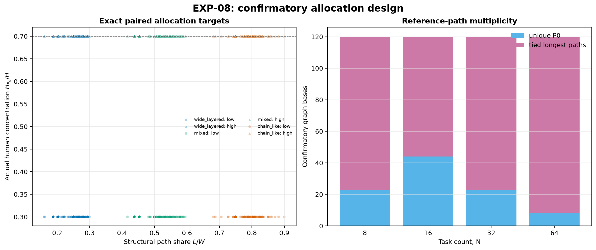

# EXP-08: общий human-work и концентрация на reference path

## Дизайн и чистота выборки

EXP-08 использует **480** новых confirmatory graph/weight-основ в
namespace `EXP-08-confirmatory-v1`. Ни один DAG или raw
seed EXP-07 и ни одна из 240 development-основ не входят в оценки эффектов.
Отклонено 130 attempts; причины сохранены. Все 24 ячейки
`N × topology × weight type` содержат по 20 принятых наблюдений.

Reference path P0 выбран на structural weights при C=gamma=1 до allocations
seeded tie-break, не связанным с `task_id`. У 382 из 480 основ
существует более одного равного longest path; они помечены как `tied`.

[SVG-версия](../figures/exp08_allocation_coverage.svg).

## EXP-08A: aggregate identity

В paired low/high allocations строго сохраняются DAG, weights, общий H и W4;
концентрация H на P0 меняется с 0.30 до 0.70. Проверены H, W4, L4, B4,
активные ветви и structural critical path во всех 2880 комбинациях
двух phase profiles и P=1/4/8. Полный invariant check прошли
**2880/2880** строк.

## EXP-08B: влияние на расписание фиксированной политики

Эффект определён как high concentration минус low и нормирован на общий B4.
`positive` означает рост времени/очереди, `negative` — снижение,
`practically_equivalent` — весь bootstrap interval внутри ±0.01, иначе
`inconclusive`. Primary rows — профиль `io`, P=4/8; P=1 — negative control,
`equal_alternating` — robustness.

| Profile | P | Metric | n | Median [95% bootstrap] | Decision |
|---|---:|---|---:|---:|---|
| io | 1 | `delta_makespan_normalized` | 480 | 0.0000 [0.0000, 0.0000] | **practically_equivalent** |
| io | 1 | `delta_queue_normalized` | 480 | 0.0000 [0.0000, 0.0000] | **practically_equivalent** |
| io | 1 | `delta_blocked_any_normalized` | 480 | 0.0000 [0.0000, 0.0000] | **practically_equivalent** |
| io | 4 | `delta_makespan_normalized` | 480 | -0.0077 [-0.0090, -0.0065] | **practically_equivalent** |
| io | 4 | `delta_queue_normalized` | 480 | -0.0012 [-0.0036, 0.0020] | **practically_equivalent** |
| io | 4 | `delta_blocked_any_normalized` | 480 | -0.0034 [-0.0049, -0.0016] | **practically_equivalent** |
| io | 8 | `delta_makespan_normalized` | 480 | -0.0117 [-0.0120, -0.0101] | **negative** |
| io | 8 | `delta_queue_normalized` | 480 | -0.0011 [-0.0038, 0.0014] | **practically_equivalent** |
| io | 8 | `delta_blocked_any_normalized` | 480 | -0.0049 [-0.0079, -0.0037] | **practically_equivalent** |
| equal_alternating | 1 | `delta_makespan_normalized` | 480 | 0.0000 [0.0000, 0.0000] | **practically_equivalent** |
| equal_alternating | 1 | `delta_queue_normalized` | 480 | 0.0000 [0.0000, 0.0000] | **practically_equivalent** |
| equal_alternating | 1 | `delta_blocked_any_normalized` | 480 | 0.0000 [0.0000, 0.0000] | **practically_equivalent** |
| equal_alternating | 4 | `delta_makespan_normalized` | 480 | -0.0060 [-0.0067, -0.0058] | **practically_equivalent** |
| equal_alternating | 4 | `delta_queue_normalized` | 480 | -0.0031 [-0.0045, -0.0020] | **practically_equivalent** |
| equal_alternating | 4 | `delta_blocked_any_normalized` | 480 | -0.0033 [-0.0042, -0.0020] | **practically_equivalent** |
| equal_alternating | 8 | `delta_makespan_normalized` | 480 | -0.0069 [-0.0079, -0.0065] | **practically_equivalent** |
| equal_alternating | 8 | `delta_queue_normalized` | 480 | -0.0023 [-0.0035, -0.0013] | **practically_equivalent** |
| equal_alternating | 8 | `delta_blocked_any_normalized` | 480 | -0.0037 [-0.0048, -0.0026] | **practically_equivalent** |

[SVG-версия](../figures/exp08_schedule_effects.svg).

Sensitivity decisions для margins 0.005 и 0.02 и доли individual effects за
пределами margin сохранены в `exp08_summary.csv`. Описательная стратификация
по N, topology, weight type и unique/tied path находится в
`exp08_strata.csv`; она не заменяет overall confirmatory decision.

## EXP-08C: differentiated slowdown

При C=1 и gamma=1.3 рост длины замороженного P0 должен точно равняться
`(gamma-C) × (0.70-0.30) × H`. Identity прошла
**480/480**
пар. P0 остался глобальным longest path в обеих allocations для 229 из
480 пар; только эта path-stable подвыборка используется для
confirmatory-вывода о глобальном L4. Path switches сохранены отдельно.

| Scope | Metric | n | Median [95% bootstrap] | Decision |
|---|---|---:|---:|---|
| all | `delta_reference_path_length_normalized` | 480 | 0.0278 [0.0276, 0.0304] | **positive** |
| all | `delta_L4` | 480 | 3.8016 [3.1159, 4.6521] | **exploratory_only** |
| all | `delta_B4` | 480 | 2.2730 [1.5579, 3.1104] | **exploratory_only** |
| path_stable | `delta_reference_path_length_normalized` | 229 | 0.0524 [0.0502, 0.0552] | **positive** |
| path_stable | `delta_L4` | 229 | 5.8752 [5.5296, 6.3936] | **positive** |
| path_stable | `delta_B4` | 229 | 3.4560 [2.7648, 4.3200] | **positive** |

Строки `all / delta_L4` и `all / delta_B4` являются exploratory: глобальный
путь может переключиться. Confirmatory-интерпретация этих метрик разрешена
только для `path_stable`; identity для длины замороженного P0 использует все
480 пар.

[SVG-версия](../figures/exp08_critical_path_effects.svg).

## Exact-аудит

Scope и единый time limit выбраны автоматически по замороженному timing-rule
на development-потоке до генерации confirmatory-основ. Рассчитано
16 сценариев; статусы: **{"OPTIMAL": 16}**.
Только `OPTIMAL` objectives можно обозначать как T-star; `FEASIBLE` incumbents
сохраняются вместе с bound и gap.

Ресурсная поправка сделана только по statuses/wall time, без записи objectives:
первичный экран `N=8/16, 5 s` и повторный `N=8, 30 s` не доказали все
`wide_layered, P=4` случаи. До confirmatory-генерации scope был единообразно
зафиксирован как `N=8`, homogeneous, `mixed/chain_like`, observation indices
0/1, allocations low/high и P=4/8 с limit 30 s.

| P | Proven pairs | Median delta T-star / B4 [95% bootstrap] | Decision |
|---:|---:|---:|---|
| 4 | 4 | 0.0010 [-0.0150, 0.0080] | **inconclusive** |
| 8 | 4 | 0.0010 [-0.0150, 0.0080] | **inconclusive** |

Полные 8 proven paired contrasts сохранены отдельно; малая
exact-подвыборка является аудитом policy-результата, а не заменяет основную
480-графовую оценку.

## Ограничения

- topology family по наследству генератора смешана с rho_L bin;
- результаты расписания относятся к `bottom_level_fcfs_v1`, а не автоматически
  к оптимуму;
- equivalence margin 0.01 является engineering threshold;
- tied structural paths и path switches не смешиваются с path-stable выводом;
- development timing не используется как outcome.

## Файлы

- `exp08_confirmatory_attempts.csv`, `exp08_confirmatory_dags.csv`;
- `exp08_runs.csv`, `exp08_invariants.csv`, `exp08_pairs.csv`;
- `exp08_summary.csv`, `exp08_strata.csv`, `exp08_exact.csv`,
  `exp08_exact_pairs.csv`;
- `exp08_freeze.json`, `exp08_manifest.json` и этот отчёт;
- три пары PNG/SVG в `figures/`.

Текст статьи в рамках EXP-08 не менялся.
