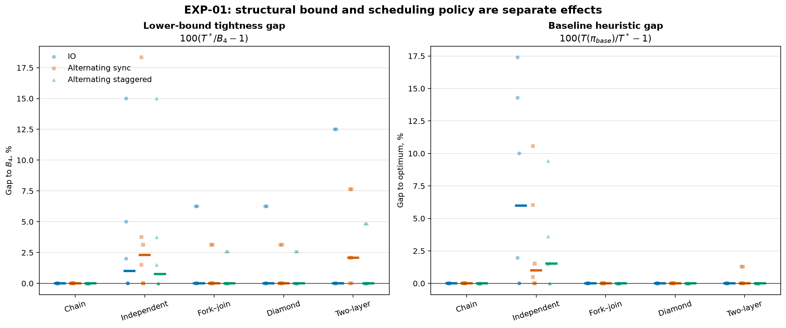
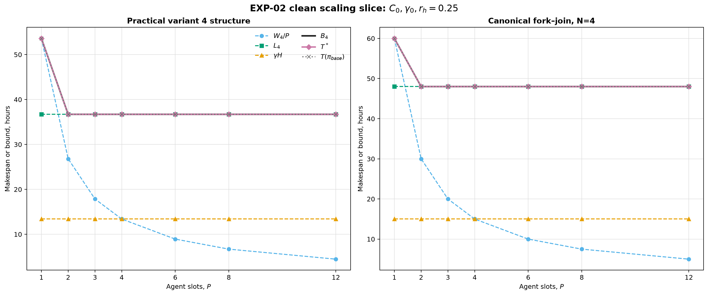
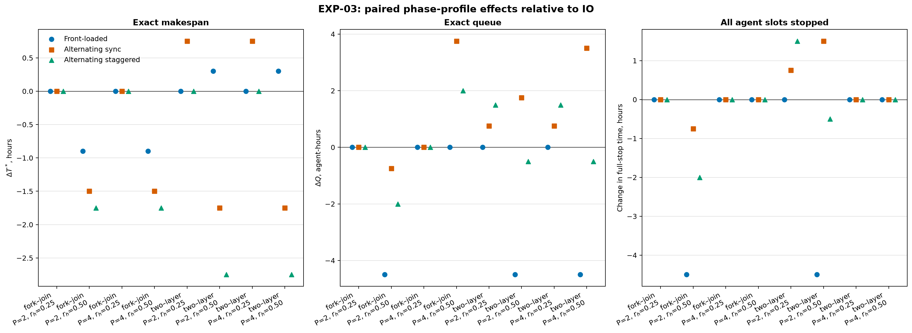
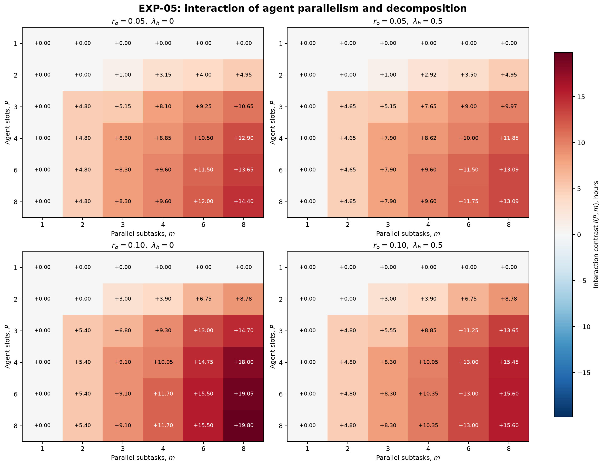
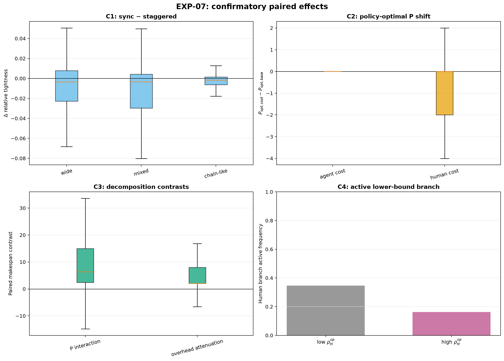
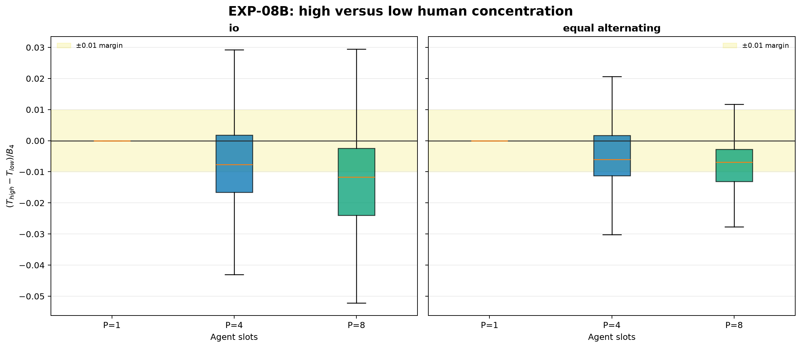
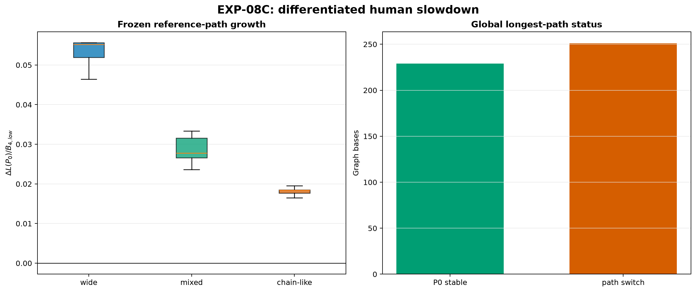

# Общий отчёт по вычислительным экспериментам EXP-00—EXP-08

Дата обновления: 2026-08-10

Статус: серии EXP-00—EXP-08 регенерированы после публикационного аудита.

## 1. Резюме

Проведённая цепочка экспериментов последовательно проверила вычислительное
ядро модели M4, достижимость структурной нижней границы, влияние фазового
расписания, числа агентных слотов, декомпозиции, overhead, ошибок параметров,
топологии DAG и размещения human-work на критическом пути.

Главные результаты:

1. Расчёты практических вариантов 2—4 воспроизведены, а опубликованные сроки
   доказаны как оптимальные для формализованной модели. Однако исходное
   расписание варианта 2 недопустимо при единственном человеческом ресурсе.
2. Нижняя граница
   $B_4=\max\{W_4/P,L_4,\gamma H\}$ корректна, но не всегда достижима:
   в EXP-01 найдено 30 точных контрпримеров из 90, максимальный разрыв
   $T^*/B_4-1$ равен 18.333%.
3. Агрегаты $A,H,W_4,L_4,B_4$ не определяют makespan. Расположение human-фаз,
   очередь и удержание агентных слотов могут менять $T^*$ при неизменной
   нижней границе.
4. Рост числа агентов не обязан монотонно улучшать срок. Если $C(P)$ или
   $\gamma(P)$ растут, на исследованных точных сетках возникает конечный
   оптимум, обычно около $P=2$.
5. Декомпозиция полезна за счёт снятия сериализации, но её оптимальная
   гранулярность конечна. U-образный точный профиль получен в 12 из 13 кривых
   EXP-04 — во всех кривых с положительным overhead; исключение составляет
   общий нулевой срез.
6. На канонической точной сетке 96 из 100 внутренних interaction contrasts
   положительны, четыре равны нулю, отрицательных нет. Это не означает
   безусловной пользы дробления: абсолютный выигрыш положителен в 74 точках и
   отрицателен в 26.
7. Преимущество практического варианта 4 над вариантом 3 сохранилось во всех
   5000 случайных и 382 заранее заданных adverse парах EXP-06. Это устойчивость
   внутри замороженной модели ошибок, а не универсальная гарантия.
8. В пилоте из 1440 сценариев на 480 синтетических структурных основах
   поддержаны направления C2 и C3:
   дополнительные cost-множители не сдвигают policy-optimal $P$ вверх, а
   выигрыш декомпозиции усиливается доступным параллелизмом и ослабляется
   overhead.
9. Исходный C1 про «sync» не подтверждён и ретроспективно признан неверно
   названным: эксперимент сравнивал два асинхронных профиля разной
   регулярности, а не настоящую wall-clock синхронизацию.
10. Исходный C4 также был некорректен: при фиксированном общем $H$ и
    $C=\gamma$ одна концентрация human-work не меняет агрегатные ветви границы.
    EXP-08 подтвердил это в 2880/2880 проверках и дал корректную замену:
    при $\gamma>C$ перенос human-work на замороженный reference path строго
    увеличивает его длину — identity прошла 480/480 пар.

## 2. Общая модель и методика

Во всех сериях используется одна семантика расписания:

- начатая задача занимает один агентный слот до завершения последней фазы;
- во время ожидания человека задача продолжает удерживать этот слот;
- все human-фазы используют один непрерываемый ресурс мощности 1;
- фазы задачи выполняются последовательно;
- successor становится доступен только после завершения predecessors;
- $C(P)$ масштабирует agent-work, $\gamma(P)$ — human-work;
- очередь, blocked time и реализованная resource chain вычисляются из
  расписания и не входят автоматически в $W_4$, $L_4$ или $B_4$.

В отчётах строго различаются:

- **нижняя граница** $B_4$;
- **точный makespan** $T^*$ — только objective со статусом `OPTIMAL`;
- **incumbent** со статусом `FEASIBLE`, который не обозначается как $T^*$;
- **makespan фиксированной политики** $T(\pi)$;
- **ретроспективный анализ**, который не меняет исходный confirmatory decision.

Расчёты выполняются на целочисленной tick-сетке с `Decimal`. Точные задачи
решаются CP-SAT с одним worker и фиксированным seed. Для крупных синтетических
выборок применяется заранее фиксированная детерминированная политика
`bottom_level_fcfs_v1`, а exact-подвыборки служат отдельным аудитом.

Каждый эксперимент сохраняет frozen matrix, полные входы и результаты,
статусы solver, manifest с SHA-256, код генерации отчёта и воспроизводимые
PNG/SVG. Ресурсные поправки делались глобально по статусам и времени до
содержательного просмотра соответствующих исходов.

## 3. Обзор серий

| Серия | Основной объём | Тип вывода | Ключевой результат |
|---|---:|---|---|
| EXP-00 | 3 практических сценария | exact | Варианты 2—4 `OPTIMAL`; сроки 47.8, 43.2 и 36.7 ч |
| EXP-01 | 90 сценариев | exact | 30 случаев $T^*>B_4$, max gap 18.333% |
| EXP-02 | 70 сценариев | exact | Конечный оптимум $P$ при росте $C(P)$ или $\gamma(P)$ |
| EXP-03 | 32 сценария, 24 пары | exact | В 14/24 пар одинаковый $B_4$, но разный $T^*$ |
| EXP-04 | 66 уникальных сценариев | exact | 12/13 U-образных кривых при overhead |
| EXP-05 | 156 уникальных сценариев | exact | 96 positive, 4 zero, 0 negative interaction contrasts |
| EXP-06 | 20 scale-точек, 5000 random и 382 adverse пары | exact | Ни одной смены ранжирования в замороженных error models |
| EXP-07 | 480 структурных основ × 3 размещения, 28800 policy-сценариев, 36 exact | policy + exact audit | C2/C3 supported в пилоте; C1/C4 not supported |
| EXP-08 | 240 development + 480 confirmatory основ | identity + policy + exact audit | Исправленная постановка концентрации human-work |

В основных сохранённых матрицах выполнено более 11 тысяч запусков точного
решателя, а также десятки тысяч policy-сценариев на синтетических DAG. Это не
превращает синтетические параметры в эмпирические оценки, но даёт широкую
проверку внутренних механизмов модели.

## 4. Результаты по экспериментам

### 4.1. EXP-00 — воспроизведение статьи

Для практических вариантов 2—4 получены:

| Вариант | $B_4$, ч | $T^*$, ч | Baseline, ч | Gap baseline |
|---:|---:|---:|---:|---:|
| 2 | 47.8 | 47.8 | 48.6 | 0.8 ч |
| 3 | 43.2 | 43.2 | 43.6 | 0.4 ч |
| 4 | 36.7 | 36.7 | 37.1 | 0.4 ч |

Во всех трёх случаях активна critical-path ветвь. Декомпозиция между
вариантами 3 и 4 сохраняет $A=34.6$, $H=19.0$, $W_4=53.6$, но сокращает
$L_4$ и $T^*$ на 6.5 ч, или примерно на 15%.


Вариант 2 показывает, почему сумма ожиданий человека не определяет срок:
оптимальное расписание имеет очередь 22.2 агент-часа, baseline — только 12.2,
но baseline заканчивается на 0.8 ч позже из-за расположения ожидания на
реализованной критической цепочке.

Подробности: [отчёт EXP-00](exp00_report.md).

### 4.2. EXP-01 — недостижимость $B_4$

Все 90 сценариев доказаны как `OPTIMAL`. Положительный tightness gap найден в
30 точках. На цепочках граница достигнута в 18/18 случаев, на остальных
топологиях — в 42/72.



Минимальный зафиксированный контрпример — diamond при $N=4$, $P=2$,
$r_h=0.50$: $B_4=48.00$, $T^*=49.25$, gap 1.25 ч. Причина — дополнительная
ресурсная цепочка повторных human-фаз, которой нет среди трёх агрегатных ветвей
$B_4$.

Следствие: равенство $T^*=B_4$ допустимо утверждать только для конкретно
доказанных сценариев, но не как свойство модели в целом.

Подробности: [отчёт EXP-01](exp01_report.md).

### 4.3. EXP-02 — масштабирование по числу агентов

Все 70 точек доказаны как `OPTIMAL`. При постоянных $C=\gamma=1$ рост $P$
быстро упирается в critical-path или human-ветвь. При синтетическом росте
$C(P)$ или $\gamma(P)$ во всех четырёх соответствующих кривых возникает
внутренний минимум $T^*$ при $P=2$.



Например, для practical-v4 при растущем agent-cost минимум равен 38.3515 ч
при $P=2$, а к $P=12$ срок увеличивается ещё на 31.65375 ч. Поэтому
«добавление агентов» — не монотонный рычаг, если стоимость координации или
человеческого сопровождения растёт вместе с $P$.

Подробности: [отчёт EXP-02](exp02_report.md).

### 4.4. EXP-03 — расположение human-фаз

Все 32 сценария доказаны как `OPTIMAL`. В 14 из 24 paired comparisons
одинаковые DAG, $A,H,W_4,L_4,B_4,C,\gamma$ дали разные $T^*$.



Максимальная выбранная пара имеет общий $B_4=36.0$ ч, но
$T^*_{IO}=40.5$ и $T^*_{profile}=37.75$: разница −2.75 ч. Даже при одинаковом
числе human-запросов front-loaded и IO различаются в 4 из 8 пар, поэтому
эффект не сводится только к количеству фаз.

В прямых сравнениях профилей, исторически названных sync/staggered, первый
имел больший $T^*$ в 6 из 8 случаев, равный — в двух. После EXP-07 этот
результат следует называть сравнением регулярного и нерегулярного
асинхронных профилей: настоящая синхронизация wall-clock окон не моделировалась.

Подробности: [отчёт EXP-03](exp03_report.md).

### 4.5. EXP-04 — контролируемая декомпозиция

Все 66 уникальных сценариев EXP-04B доказаны как `OPTIMAL`. При нулевом
overhead минимальный $T^*$ равен 30.0 ч при $m=3$, но правая часть кривой
выходит на плато. Во всех 12 кривых с положительным overhead доказан внутренний
U-образный минимум; общий итог — 12 из 13 кривых.


При $r_o\le0.10$ оптимальное $m$ обычно равно 3. При $r_o=0.20$ оно снижается
до 2, а штраф избыточной гранулярности $T^*(8)-\min T^*$ достигает 20.7 ч при
полностью человеческом overhead.

Следствие: декомпозиция — не безусловное «чем мельче, тем лучше». Польза от
снятия сериализации должна сравниваться с растущими coordination и integration
costs.

Подробности: [отчёт EXP-04](exp04_report.md).

### 4.6. EXP-05 — взаимодействие $P$ и гранулярности

Все 156 уникальных сценариев доказаны как `OPTIMAL`. Для положительного
overhead вычислено 100 внутренних interaction contrasts:

- 96 положительных;
- 4 нулевых — все при $P=2,m=2$;
- 0 отрицательных.



Максимальный interaction равен 19.8 ч при $P=8,m=8,r_o=0.10,\lambda_h=0$.
Перенос половины overhead на человека уменьшил выигрыш декомпозиции в 37 из
60 сопоставимых ячеек и не изменил его в 23; усилений не было.

Оптимальная гранулярность зависит от доступного параллелизма: при положительном
overhead для $P=1,2$ обычно минимизирует $m=1$, а при $P=3\ldots8$ —
$m=2\ldots4$.

Подробности: [отчёт EXP-05](exp05_report.md).

### 4.7. EXP-06 — масштаб и устойчивость ранжирования

EXP-06A подтвердил все линейные scale identities на 20/20 `OPTIMAL` точках.
Общий множитель времени не меняет безразмерные показатели и ранжирование.

В EXP-06B вариант 4 сохранил преимущество над вариантом 3 во всех 5000
доказанных случайных парах при уровнях относительной ошибки до $u=0.50$.
Минимальный запас на этом уровне равен 3.30 ч. Для нуля событий из 1000 на
каждом уровне one-sided 95% upper bound вероятности составляет 0.002991 —
наблюдаемое отсутствие reversals не выдаётся за нулевую вероятность.


В EXP-06C пересечение не найдено ни в одном из двух adverse-направлений до
$u=0.95$. Итоговый запас равен 1.25 ч для agent-фазы критической тестовой
задачи и 3.15 ч для её human-фаз.

Вывод ограничен замороженными распределениями и направлениями ошибок; это не
глобальный robust optimization по всем параметрам.

Подробности: [отчёт EXP-06](exp06_report.md).

### 4.8. EXP-07 — устойчивость к синтетической топологии

Сгенерировано 480 общих основ «DAG плюс веса»; каждая повторена для трёх
размещений human-work, итого 1440 сценариев в 72 ячейках. Полная выборка
оценивает фиксированную политику, а не оптимум. Доверительные интервалы получены
кластерным bootstrap по общей структурной основе. Pilot-extension gate выполнен
частично: runner не исполнил предусмотренные ветви key-cell и MCSE.

| Claim | Основной результат | Решение |
|---|---:|---|
| C1: regular minus irregular asynchronous profile | −0.00217 [−0.00261; −0.00108] | not supported |
| C2: сдвиг policy-optimal $P$ при agent-cost | 0.0000 | supported |
| C2: сдвиг policy-optimal $P$ при human-cost | 0.0000 | supported |
| C3: decomposition interaction | 6.4 [6.0; 6.8] | supported |
| C3: overhead attenuation | 2.0 [2.0; 2.0] | supported |
| C4: high minus low human-active frequency | −0.1833 | not supported |



#### Ретроспективный вывод по C1

`alternating_sync` не синхронизировал human-фазы разных задач во времени. В
обоих treatments каждая задача имела четыре равные human-фазы; различались
только agent-отрезки $A_i/3$ против перестановок
$A_i\{1/6,2/6,3/6\}$. Поэтому C1 не даёт вывода о настоящей синхронизации.
Маленькая exact-подвыборка дала противоположный знак всего на четырёх proven
парах и не отменяет policy-результат; она подчёркивает различие estimands.

#### Почему C4 был отклонён как постановка

Ветвь $\gamma H$ зависит от общего $H$, а не от доли $H$ на критическом пути.
Кроме того, исходные low/high strata не сохраняли общий human share точно.
Поэтому наблюдаемый отрицательный агрегированный знак нельзя интерпретировать
как эффект концентрации. Корректная paired-постановка выполнена в EXP-08.

Подробности: [отчёт EXP-07](exp07_report.md).

### 4.9. EXP-08 — общий $H$ и его концентрация на reference path

EXP-08 полностью отделён от EXP-07 по данным. Использованы 240 новых
development-основ только для allocator/timing и 480 независимых confirmatory-
основ. Пересечений raw seed между потоками и с EXP-07 нет. У 382 из 480
confirmatory-основ structural longest path не единственен; reference path
$P_0$ выбран заранее seeded tie-break, а unique/tied случаи сохранены отдельно.

#### EXP-08A: агрегатная identity

В low/high allocations сохраняются DAG, weights, общий $H$, $A$ и $W_4$;
концентрация $H_{P_0}/H$ меняется с 0.30 до 0.70. При $C=\gamma=1$ все
2880/2880 сравнений подтвердили неизменность $H,W_4,L_4,B_4$, active branches
и structural critical path.

#### EXP-08B: эффект на фиксированную политику



Для primary-профиля IO:

- $P=1$: negative control фиксированной политики, $\Delta T=0$;
- $P=4$: медиана $\Delta T/B_4=-0.0077$, interval
  $[-0.0090,-0.0065]$ полностью лежит внутри engineering margin ±0.01 —
  `practically_equivalent`;
- $P=8$: медиана $-0.0117$, interval $[-0.0120,-0.0101]$ — высокая
  концентрация уменьшила makespan фиксированной политики более чем на margin;
- для equal-alternating оба primary $P$ practically equivalent.

Exact-аудит содержит 16/16 `OPTIMAL` сценариев, но только четыре proven пары
на каждый $P$. Медиана exact-effect равна 0.001, interval
$[-0.015,0.008]$ — `inconclusive`. Поэтому результат IO/$P=8$ относится к
фиксированной политике и не переносится на $T^*$.

#### EXP-08C: differentiated slowdown

При $C=1,\gamma=1.3$ identity

$$
\Delta L(P_0)=(\gamma-C)(0.70-0.30)H
$$

прошла в 480/480 пар. Медианный нормированный рост замороженного пути равен
0.0278 с bootstrap interval [0.0276; 0.0304].



$P_0$ остался глобальным longest path в обеих allocations для 229/480 пар.
Только на этой path-stable подвыборке глобальные $L_4$ и $B_4$ имеют
confirmatory-интерпретацию: медианные изменения равны 5.8752 и 3.4560.
All-pairs изменения глобальных $L_4/B_4$ оставлены exploratory из-за
переключений критического пути.

Подробности: [отчёт EXP-08](exp08_report.md).

## 5. Сквозные научные выводы

### 5.1. Что подтверждено

- Формализованные практические варианты 2—4 внутренне согласованы, их сроки
  оптимальны в модели M4.
- $B_4$ является полезной структурной нижней границей и правильно показывает
  смену активного ограничения, но её достижимость требует отдельной проверки.
- Фазовый порядок и resource contention являются самостоятельными факторами
  makespan поверх агрегатных work/path/human ограничений.
- При растущей стоимости координации или человеческого сопровождения существует
  конечный полезный уровень параллелизма.
- Декомпозиция и доступные агентные слоты взаимодополняют друг друга, но
  overhead создаёт конечную оптимальную гранулярность.
- Направления C2 и C3 повторились сначала на точных канонических сетках, затем
  на широкой policy-выборке синтетических топологий.
- При фиксированном $H$ и $C=\gamma$ его концентрация не меняет агрегатную
  нижнюю границу; при $\gamma>C$ концентрация на замороженном пути строго
  увеличивает длину этого пути.

### 5.2. Что опровергнуто или не поддержано

- $T^*=B_4$ не является универсальным тождеством.
- Сумма human-очереди сама по себе не ранжирует расписания по makespan.
- Большее $P$ не гарантирует меньший срок.
- Более мелкая декомпозиция не всегда лучше.
- Исходный C1 не поддержан, а его label `sync` не соответствует treatment.
- Исходный C4 не идентифицировал эффект концентрации при фиксированном $H$.

### 5.3. Что остаётся условным

- EXP-06 доказывает устойчивость только внутри заданных random/adverse error
  models.
- EXP-07 и основная часть EXP-08B относятся к одной фиксированной policy.
- Policy-улучшение EXP-08B при IO/$P=8$ не подтверждено как exact effect.
- Topology family в EXP-07/08 смешана с корзиной $\rho_L$.
- В EXP-08 большинство structural longest paths имеют ties; выводы о
  конкретном $P_0$ требуют seeded selection и отдельной маркировки multiplicity.
- Настоящее влияние синхронизации human-фаз не проверено.

## 6. Рекомендации для доработки статьи

В основной текст можно переносить:

1. воспроизведённые exact-результаты вариантов 2—4;
2. явную оговорку, что $B_4$ — нижняя граница, но не универсально достижимый
   makespan;
3. различие между $B_4$, $T^*$ и $T(\pi)$;
4. механизм resource chain из повторных human-запросов;
5. конечный оптимум $P$ при растущих $C(P),\gamma(P)$ как модельный эффект;
6. U-образную зависимость от гранулярности и interaction с $P$;
7. устойчивые C2/C3 с точным описанием их estimands;
8. исправленную identity EXP-08A и differentiated-slowdown identity EXP-08C.

С оговоркой policy-specific можно обсуждать EXP-08B при $P=8$. Нельзя
переносить как подтверждённые:

- вывод о пользе «sync» из C1;
- исходный C4;
- всеобщую достижимость $B_4$;
- универсальную устойчивость варианта 4 к любым ошибкам;
- policy-effect как доказанный exact effect.

## 7. Общие ограничения программы экспериментов

- Длительности детерминированы; нет rework, learning, failures и динамического
  раскрытия графа.
- Человеческий ресурс имеет мощность 1, а ожидающая задача удерживает слот.
- Большая часть параметров и распределений синтетическая и не калибрована по
  данным реальной команды.
- Точные сетки конечны и не доказывают глобальные оптимумы вне выбранных
  $P,m$ и error families.
- CP-SAT оптимизирует makespan, но не очередь как вторичную цель.
- Синтетические family effects нельзя автоматически переносить на реальные
  проекты или причинные эффекты организационных решений.

## 8. Воспроизводимость и навигация

Все команды выполняются из каталога `simple_model_full/experiments`:

```bash
uv sync --python 3.13
uv run pytest -q
uv run python -m experiments run --experiment EXP-00
# ...
uv run python -m experiments run --experiment EXP-07
uv run python -m experiments run --experiment EXP-08 --stage development
uv run python -m experiments run --experiment EXP-08 --stage confirmatory
```

Индивидуальные отчёты:

- [EXP-00](exp00_report.md)
- [EXP-01](exp01_report.md)
- [EXP-02](exp02_report.md)
- [EXP-03](exp03_report.md)
- [EXP-04](exp04_report.md)
- [EXP-05](exp05_report.md)
- [EXP-06](exp06_report.md)
- [EXP-07](exp07_report.md)
- [EXP-08](exp08_report.md)

Для каждой серии рядом находятся CSV/JSON с полными результатами и manifest.
Планы, код экспериментов и frozen matrices хранятся в проекте. Общий отчёт не
изменяет текст статьи и не заменяет индивидуальные отчёты, где зафиксированы
детали генерации, resource amendments и ограничения каждого estimand.
